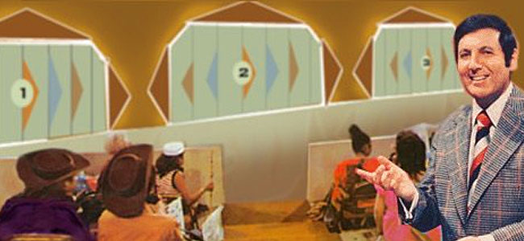

# (PART\*) Part I {-}

# The Monty Hall Problem

```{block, type="epigraph"}
...in no other branch of mathematics is it so easy for experts to blunder as in probability theory.\
---Martin Gardner
```

`r tufte::newthought("Imagine")` you're on a game show. There are three doors, one with a prize behind it. You're allowed to pick any door, so you choose the first one at random, door A.

```{marginfigure, echo=TRUE}

The Monty Hall problem is named after the creator and host of the game show *Let's Make a Deal*.
```

Now the rules of the game require the host to open one of the other doors and let you switch your choice if you want. Because the host doesn't want to give away the game, they always open an empty door.

In your case, the host opens door C: no prize, as expected. "Do you want to switch to door B?", the host asks.

Pause a moment to think about your answer before reading on.

`r tufte::newthought("What")` did you decide? Did you conclude it doesn't matter whether you stick with door A or switch to door B?

```{marginfigure, echo=TRUE}

Marilyn vos Savant made the Monty Hall problem famous when she solved it correctly in her "Ask Marilyn" column for *Parade* magazine. Read more about it in [*The New York Times*](https://www.nytimes.com/1991/07/21/us/behind-monty-hall-s-doors-puzzle-debate-and-answer.html).
```

If so, you're in good company. Most people find this answer sensible, including some professors of statistics and mathematics. They figure there are only two possibilities remaining, door A and door B, each with the same one-in-two chance of being the winner. So it doesn't matter which one you pick.

But the right answer is you should switch. Door B is now twice as likely to be the winner as door A. Why?

The reason is subtle. One way to think about it is that the host's choice of which door to open is a bit of a tell. Maybe they *had* to open door C, because the prize is behind door B and they didn't want to give that away. Of course, it could be behind door A instead, so maybe they just picked door C at random. But there was only a one-in-three chance the prize would be behind door A. Which means there's a two-in-three chance they didn't really have a choice, they had to open door C to avoid showing you the prize behind door B.

```{r montygrid, echo=FALSE, fig.margin=TRUE, fig.width=5, fig.cap="The hundred-door version of the Monty Hall problem, suggested by Marilyn vos Savant"}
open_door <- readPNG("img/door_open.png") %>% rasterGrob()
closed_door <- readPNG("img/door_closed.png") %>% rasterGrob()

place_image <- function(row, img) {
  annotation_custom(img, xmin = row[1], xmax = row[1] + 1,
                    ymin = row[2] + .01, ymax = row[2] + .99)
}

open_grid <- expand.grid(x = 0:9, y = 9:0)
open_grid <- open_grid[-c(1, 59), ]
closed_grid <- data.frame(x = c(0, 8), y = c(9, 4))

ggplot() +
  theme_void() + xlim(0, 10) + ylim(0, 10) +
  apply(open_grid, 1, place_image, open_door) +
  apply(closed_grid, 1, place_image, closed_door)
```

Here's another way to think about it. Imagine the game had a hundred doors instead of just three. And suppose again you start by picking the first door at random. Then the host opens *all the other doors but one*, door $59$ let's say. You have to ask yourself: why did they pick door $59$ to leave closed?? Almost certainly because that's where the prize is hidden! Maybe you got really lucky and picked right with the first door at the beginning. But it's way more likely you didn't, and the host had to keep door $59$ closed to avoid giving away the game.


## Diagramming the Solution

```{r montytree1, echo=FALSE, dev="png", fig.margin=TRUE, fig.cap="First stage of a tree diagram for the Monty Hall problem"}
nodes <- bind_rows(
  list(text = "C",      parent = 0, p = "1/3", leaf_p = NA),
  list(text = "B",      parent = 0, p = "1/3", leaf_p = NA),
  list(text = "A",      parent = 0, p = "1/3", leaf_p = NA),
  list(text = "Open B", parent = 1, p = "",    leaf_p = "1/3"),
  list(text = "Open C", parent = 2, p = "",    leaf_p = "1/3"),
  list(text = "Open B", parent = 3, p = "1/2", leaf_p = "1/6"),
  list(text = "Open C", parent = 3, p = "1/2", leaf_p = "1/6")
)

nodes <- compute_tree(nodes, aspect_ratio = 1.4)
leaves <- nodes[nodes$tier == max(nodes$tier), ]
padding <- unit(.75, "lines")

ggplot(nodes) +
  geom_segment(aes(x = x, y = y, xend = xend, yend = yend, 
                   colour = as.factor(parent))) +  
  geom_label(aes(x = x, y = y, label = text, colour = as.factor(parent)), 
             label.padding = padding, label.size = NA,
             fontface = "italic") +
  geom_text(aes(x = p_x, y = p_y, label = p, angle = p_angle,
                colour = as.factor(parent))) +
  scale_colour_manual(values = c("black", "transparent", "transparent",                                        "transparent")) +
  geom_text(aes(x = leaf_p_x, y = leaf_p_y, label = ""), data = leaves) + 
  xlim(0, 1.2) + ylim(0, 1) +
  theme_void() +
  theme(legend.position = "none")
```
```{r montytree2, echo=FALSE, dev="png", fig.margin=TRUE, fig.cap="Second stage"}
ggplot(nodes) +
  geom_segment(aes(x = x, y = y, xend = xend, yend = yend)) +  
  geom_label(aes(x = x, y = y, label = text), label.size = NA,
             label.padding = padding) +
  geom_text(aes(x = p_x, y = p_y, label = p, angle = p_angle)) +
  geom_text(aes(x = leaf_p_x, y = leaf_p_y, label = ""), data = leaves) + 
  xlim(0, 1.2) + ylim(0, 1) +
  theme_void()
```
```{r montytree3, echo=FALSE, dev="png", fig.margin=TRUE, fig.cap="Third and final stage"}
draw_tree(nodes, node_fontface = "plain")
```

`r tufte::newthought("A")`  picture helps clarify things. At first the prize could be behind any of the three doors, with equal probability each way. So we draw a tree with three branches, each labeled with a probability of $1/3$. Figure \@ref(fig:montytree1) shows the result.

Now, which door the host opens may depend on where the prize is, i.e. which branch we're on. If it's behind door C, they won't show you by opening that door. They would have to open door B in this case.

Likewise, if the prize is behind door C, then opening door B is their only option.

Only if the prize is behind door A do they have a choice: open either door B or door C. In that case it's a tossup which door they'll open, so each of those possibilities has a 1/2 chance. Check out Figure \@ref(fig:montytree2).

Now imagine playing the game over and over. A third of the time things will follow the top path; a third of the time they'll follow the middle one; and the remaining third they'll follow one of the two bottom paths.

When things follow the bottom branches, half of those times the host will open door B, and half the time they'll open door C. So one in every six plays will follow the *A-and-Open-B* path. And one in every six plays will follow the *A-and-Open-C* path. See Figure \@ref(fig:montytree3).

Now we can understand what happens when the host opens door C. Usually it's because the prize is behind door B. Sometimes they open door C because the prize is behind door A instead. But that's only a sixth of the time, compared to a third of the time where they open door C because the prize is behind door B.

So when you see the host open door C, you should think it's more likely you're on the middle branch, with the prize behind door B. Switch!


## Lessons Learned {#lessons}

`r newthought("Tree")`  diagrams are a handy tool for solving probability problems. They also illustrate some central concepts of probability.

Probabilities are numbers assigned to possibilities. In the Monty Hall problem, there are three possibilities for where the prize is: door A, door B, and door C. Each of these possibilities has the same probability: 1/3.

`r tufte::newthought("Some")`  possibilities are ***mutually exclusive***, meaning only one of them can obtain. The prize can't be behind door A and door B, for example. Here are more examples of mutually exclusive possibilities:

- A coin can land heads or tails, but it can't do both on the same toss.
- A card drawn from a standard deck could be either an ace or a queen, but it can't be both.
- The temperature at noon tomorrow could be 20 degrees, or it could be 25 degrees, but it can't be both.

When possibilities are mutually exclusive, their probabilities add up. For example, the initial probability the prize will be behind either door A or door B is $1/3 + 1/3 = 2/3$.  And the probability a card drawn from a standard deck will be either an ace or a queen is $4/52 + 4/52 = 8/52 = 2/13$.

`r tufte::newthought("Another")`  key concept is possibilities that are ***exhaustive***. In the Monty Hall problem, the prize has to be behind one of the three doors, so A, B, and C "exhaust" all the possibilities. Here are more examples of exhaustive possibilities:

- A card drawn from a standard deck must be either red or black.
- The temperature at noon tomorrow must be either above zero, below zero, or zero.

```{r echo=FALSE, warning=FALSE, fig.margin=TRUE, fig.height=10, fig.cap="Three  partitions for a card drawn from a standard deck"}

# setting warning=FALSE to hide buggy warnings arising from geom_tile
# see https://github.com/tidyverse/ggplot2/issues/1904

colour_partition <- rbind(
  data.frame(x = .5, y = 5.42, w = 1, h = .85),
  data.frame(x = .5, y = 4.58, w = 1, h = .85)
)

face_card_partition <- rbind(
  data.frame(x = .385, y = 3, w = .77, h = 1.7),
  data.frame(x = .885, y = 3, w = .23, h = 1.7)
)

suit_partition <- rbind(
  data.frame(x = .5, y = 1.205, w = 1, h = .425),
  data.frame(x = .5, y = 1.628, w = 1, h = .425),
  data.frame(x = .5, y = 0.79, w = 1, h = .425),
  data.frame(x = .5, y = 0.372, w = 1, h = .425)
)

img <- readPNG("img/playing_cards.png") 

ggplot() + 
  theme_void() +
  xlim(0, 1) + ylim(0, 6) +
  annotation_custom(rasterGrob(img, interpolate = TRUE), xmin = 0, xmax = 1,ymin = 0, ymax = 2) +
  annotation_custom(rasterGrob(img, interpolate = TRUE), xmin = 0, xmax = 1, ymin = 2, ymax = 4) +
  annotation_custom(rasterGrob(img, interpolate = TRUE), xmin = 0, xmax = 1,
  ymin = 4, ymax = 6) +
  geom_tile(aes(x, y, height = h, width = w), colour = "forestgreen", size = 2, fill = "transparent", data = colour_partition) +
  geom_tile(aes(x, y, height = h, width = w), colour = "forestgreen", size = 2, fill = "transparent", data = face_card_partition) +
  geom_tile(aes(x, y, height = h, width = w), colour = "forestgreen", size = 2, fill = "transparent", data = suit_partition)
```

`r tufte::newthought("In")`  our tree diagrams, each branch-point always uses a set of possibilities that is *both* exclusive *and* exhaustive. The first split on the three doors covers all the possibilities for where the prize might be, and only one of those possibilities can be the actual location of the prize. Likewise for the second stage of the diagram. On the bottom branch for example, the host must open either door B or door C given the rules, but he will only open one or the other.

When a set of possibilities is both exclusive and exhaustive, it's called a ***partition***. A partition "carves up" the space of possibilities into distinct, non-overlapping units.

There can be more than one way to partition the space of possibilities. For example, a randomly drawn playing card could be black or red; it could be a face card or not; and it could be any of the four suits ($\heartsuit$, $\diamondsuit$, $\clubsuit$, $\spadesuit$).

`r tufte::newthought("When")`  possibilities form a partition, their probabilities must add up to 1. Initially, the probability the prize will be behind one of the three doors is $1/3 + 1/3 + 1/3 = 1$. And the probability that a card drawn from a standard deck at random will be either red or black is $1/2 + 1/2 = 1$.

In a way, the fundamental principle of probability is that probabilities over a partition must add up to 1.


`r tufte::newthought("Tree")`  diagrams follow a few simple rules based on these concepts. The parts of a tree are called *nodes*, *branches*, and *leaves*: see Figure \@ref(fig:treeparts).

```{r treeparts, echo=FALSE, fig.cap="The parts of a tree diagram: nodes, branches, and leaves"}
a <- arrow(length = unit(0.01, "npc"), type = "closed")
ggplot(nodes) +
  geom_segment(aes(x = x, y = y, xend = xend, yend = yend)) +  
  geom_label(aes(x = x, y = y, label = text), label.size = NA,
             label.padding = padding) +
  xlim(0, 1.2) + ylim(0, 1) +
  theme_void() +
  annotate(geom = "segment", x = .2, y = .25, xend = 0.01, yend = .485,
           color = "firebrick", arrow = a) +
  annotate(geom = "segment", x = .2, y = .25, xend = 0.48, yend = .16,
           color = "firebrick", arrow = a) +
  annotate(geom = "label", label = "Nodes", x = .2, y = .25,
           color = "firebrick", label.size = NA) +
  annotate(geom = "segment", x = .7, y = .68, xend = 0.32, yend = .68,
           color = "steelblue", arrow = a) +
  annotate(geom = "segment", x = .7, y = .68, xend = 0.7, yend = .82,
           color = "steelblue", arrow = a) +
  annotate(geom = "segment", x = .7, y = .68, xend = 0.7, yend = .51,
           color = "steelblue", arrow = a) +  
  annotate(geom = "label", label = "Branches", x = .7, y = .68,
           color = "steelblue", label.size = NA) +
  annotate(geom = "segment", x = 1.1, y = .37, xend = 1, yend = .27,
           color = "forestgreen", arrow = a) +
  annotate(geom = "segment", x = 1.1, y = .37, xend = 1, yend = .47,
           color = "forestgreen", arrow = a) +
  annotate(geom = "label", label = "Leaves", x = 1.1, y = .37,
           color = "forestgreen", label.size = NA)
```

The rules for a tree are as follows:

*Rule 1.* Each node must use a partition. The branches coming out of it must be mutually exclusive possibilities, and they must cover all the possibilities.

*Rule 2.* The probabilities at each node must add up to $1$.

*Rule 3.*  The probability on a branch is *conditional* on the branches leading up to it.

- For example, consider the bottom path in the Monty Hall problem. The probability the host will open door C is $1/2$ there because we're assuming  the prize is behind door A.

*Rule 4.* The probability of a leaf is calculated by multiplying across the branches on the path leading to it. This number represents the probability that all possibilities on that path occur.

Notice, Rule 4 is how we got the final probabilities (the numbers in bold) we used to solve the Monty Hall problem.


## Exercises {-}

#. True or false: in the Monty Hall problem, it's essential to the puzzle that the host doesn't want to expose the prize. If they didn't care about giving away the location of the prize, there would be no reason to switch when they open door C.

#. In the version of the Monty Hall problem with a hundred doors, after the host opens every door except door 1 (your door) and door 59, the chance the car is behind door 59 is:

    a. 1/100
    b. 1/99
    c. 1/2
    d. 99/100

#. Imagine three prisoners, A, B, and C, are condemned to die in the morning. But the king decides to pardon one of them first. He makes his choice at random and communicates it to the guard, who is sworn to secrecy. She can only tell the prisoners that one of them will be released at dawn, she can't say who.
    
    Prisoner A welcomes the news, as he now has a $1/3$ chance of survival. Hoping to go even further, he says to the guard, "I know you can't tell me whether I am condemned or pardoned. But at least one other prisoner must still be condemned, so can you just name one who is?". The guard tells him that B is still condemned. "Ok", says A, "then it's either me or C who was pardoned. So my chance of survival has gone up to 1/2".

    Is prisoner A's reasoning correct? Use a probability tree to explain why/why not.

#. In a probability tree, each branch point should split into possibilities that are:

    a. Mutually exclusive.
    b. Exhaustive.
    c. Both mutually exclusive and exhaustive.
    d. None of the above.

#. Suppose you have two urns. The first has two black marbles and two white marbles. The second has three black marbles and one white marble. You are going to flip a fair coin to select one of the urns at random, and then draw one marble at random. What is the chance you will select a black marble?

    Hint: draw a probability tree and ask yourself, "if I did this experiment over and over again, how often would I draw a black marble in the long run?"

    a. 5/8
    b. 3/8
    c. 1/2
    d. 1/4