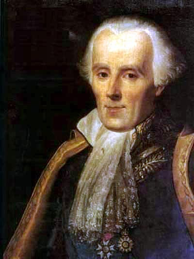

# Logic

```{block, type="epigraph"}
I can win an argument on any topic, against any opponent. People know this, and steer clear of me at parties. Often, as a sign of their great respect, they don't even invite me.\
---Dave Barry
```

`r newthought("Logic")`  is the study of what follows from what. From the information that Tweety is a bird and all birds are animals, it follows that Tweety is an animal. But things aren't always so certain. Can Tweety fly? Most birds can fly, so probably. But Tweety might be a penguin.

*Deductive* logic is the branch of logic that studies what follows with certainty. *Inductive* logic deals with uncertainty, things that only follow with high probability.

This book is about inductive logic and probability. But we need a few concepts from deductive logic to get started.


## Validity & Soundness

`r newthought("In")`  deductive logic we study "valid" arguments. An argument is ***valid*** when the conclusion must be true if the premises are true. Take this example again:

```{block, type="argument", echo=TRUE}
Tweety is a bird.\
All birds are animals.\
Therefore, Tweety is an animal.
```

The first two lines are called the *premises* of the argument. The last line is called the *conclusion*. In this example, the conclusion must be true if the premises are. So the argument is valid.

Here's another example of a valid argument:

```{block, type="argument", echo=TRUE}
Tweety is taller than Kwazi.\
Kwazi is taller than Peso.\
Therefore, Tweety is taller than Peso.
```

The argument is valid because it's just not possible for the premises to be true and the conclusion false.

Here's an example of an *invalid* argument:

```{block, type="argument", echo=TRUE}
Tweety is a bird.\
Most birds can fly.\
Therefore, Tweety can fly.
```

It's not valid because validity requires the conclusion to follow *necessarily*. If there's any way for the the premises to be true yet the conclusion false, the argument doesn't count as valid. And like we said, Tweety might be a penguin.

Valid arguments are interesting because their logic is airtight. If the assumptions of the argument are correct, there's no way to go wrong accepting the conclusion. But what if the assumptions *aren't* correct? Validity isn't everything, we also want our arguments to build on true foundations.

`r newthought("We")`  call an argument ***sound*** when it is valid *and* all the premises are true:
$$ \mbox{sound = valid + true premises}.$$
For example, here's a sound argument:

```{block, type="argument", echo=TRUE}
The author of this book is human.\
All humans are animals.\
Therefore, the author of this book is an animal.
```

Sound arguments are important because their conclusions are always true. The premises of a sound argument are true by definition. And since it's valid by definition too, that guarantees the conclusion to be true as well.

Yet deductive logic studies validity, not soundness. Why?

Because logicians aren't in the business of determining when the premises of an argument are true. As a logician, I might have no idea who Tweety is, and thus no idea whether Tweety is a bird. I might not even know whether all birds fly, or just some, or even none. That's a job for an ornithologist.

A logician's job is to assess the *logic* of an argument, the connections between its assumptions and its conclusion. So a logician just takes the premises of an argument for granted and asks, how well do those assumptions support the conclusion? That's something you don't need to know any ornithology to study. Or biology, or medicine, or physics, or whatever topic a particular argument concerns. 

`r newthought("Validity")`  is a tricky, counterintuitive concept. It's very much a hypothetical notion: it's about whether the conclusion must be true *if* the premises are true. So when we assess an argument's validity, we ignore what we know about the truth of its premises. We pretend they're true even if they aren't. We even have to ignore what we know about the conclusion.

Instead we suspend what we know about the topic, and just imagine the premises to be true. Then we ask: in this hypothetical scenario, is there any way the conclusion could be false? If there is, the argument is invalid. Otherwise, it's valid.


## Propositions

`r newthought("Arguments")`  are made out of statements, assertions that something is true. In logic we call these statements ***propositions***. And we use capital letters of the English alphabet to stand for them. For example, this argument:

```{block, type="argument", echo=TRUE}
If Aegon is a tyrant, then Brandon is a wizard.\
Aegon is a tyrant.\
Therefore, Brandon is a wizard.
```

can be summarized like this:

```{block, type="argument", echo=TRUE}
If $A$, then $B$.\
$A$.\
Therefore, $B$.
```

`r newthought("Not")`  all sentences are propositions. Some are questions, some are commands, some are expressions of worry. For example:

- What time is it?
- Pass the rooster sauce!
- Uh oh.

One way to distinguish propositions from other kinds of sentences is: propositions are capable of being true or false. It wouldn't make sense to respond to someone who asks you what time it is by saying, "what you just said is false!" And you wouldn't respond to someone's request to pass the sauce with "that's true!" Except maybe as a joke.


## Visualizing Propositions

`r newthought("We")` learned about mutually exclusive propositions in [Section](#lessons) \@ref(lessons). Two propositions are mutually exclusive when one of them being true means the other must be false. For example:

- $A$: Confucius was born in the 6th Century A.D.
- $B$: Confucius was born in the 6th Century B.C.

There is no way for both of these propositions to be true, and we can visualize this relationship in a diagram (Figure \@ref(fig:meprops)).

```{r meprops, echo=FALSE, fig.margin=TRUE, fig.cap="Mutually exclusive propositions"}

euler_diagram <- function(propositions) {
    ggplot(data = propositions) + theme_void() + coord_fixed() +
        xlim(-3,3) + ylim(-2,2) +
        theme(panel.border = element_rect(colour="black", fill=NA, size=1)) +
        geom_circle(aes(x0 = cirx, y0 = ciry, r = r)) +
        geom_text(aes(x = labx, y = laby, label = labl), parse = TRUE, size = 6)
}

propositions <- data.frame(
    cirx = c(-1.25  , 1.25),
    ciry = c(0      , 0),
    r    = c(1      , 1),
    labx = c(-2     , 2),
    laby = c(1      , 1),
    labl = c("italic(A)", "italic(B)")
)

euler_diagram(propositions)
```

Each circle represents a proposition. You can think of it as surrounding the possible situations where the proposition would be true. The circles don't overlap because there is no possible situation where both propositions in this example are true.

In contrast, these two propositions are not mutually exclusive:

- Confucius was born in Asia.
- Confucius was born in the 6th Century B.C.

When propositons are not mutually exclusive, we say they are ***compatible***. Compatible propositions overlap (Figure \@ref(fig:compropositions)). The region where the circles overlap represents the possible scenarios where both propositions are true (the "$A \wedge B$ region").

```{r compropositions, fig.margin=TRUE, echo=FALSE, fig.cap="Compatible propositions"}
propositions <- data.frame(
    cirx = c(-.5   , .5),
    ciry = c(0     , 0),
    r    = c(1     , 1),
    labx = c(-1.25 ,  1.25),
    laby = c(1     , 1),
    labl = c("italic(A)", "italic(B)")
)

euler_diagram(propositions)
```

[^eulernote]: Leonhard Euler lived from $1707$ to $1783$. You may have encountered some of his work before if you've worked with logarithms or taken calculus.

These are called ***Euler diagrams***, after the mathematician Leonhard Euler (pronounced *oiler*).[^eulernote] You may have seen Venn diagrams before, which are very similar. But in an Euler diagram, the circles don't have to overlap.

`r newthought("Sometimes")`  one circle will even contain another circle entirely. Take this example:

- Confucius was born in Asia.
- Confucius was born somewhere.

These propositions aren't just compatible. If the first is true, then the second *must* be true. Imagine an argument with the first proposition as the premise and the second proposition as the conclusion. The argument would be valid:

```{block, type="argument", echo=TRUE}
Confucius was born in Asia.\
Therefore, Confucius was born.
```

```{r entailment, echo=FALSE, fig.margin=TRUE,  fig.cap="Logical entailment"}
propositions <- data.frame(
    cirx = c(0     , 0),
    ciry = c(0     , 0),
    r    = c(1.25  , .5),
    labx = c(-.5   , -.95),
    laby = c(.5    , 1.15),
    labl = c("italic(A)", "italic(B)")
)
euler_diagram(propositions)
```

In this case we say that the first proposition ***logically entails*** the second. In terms of an Euler diagram, he first circle is contained entirely in the second (Figure \@ref(fig:entailment)). Because there is no possible situation where the first proposition is true yet the second false.

What if an argument has multiple premises? For example:

```{block, type="argument", echo=TRUE}
Zhuangzi was born in the Chinese province of  Anhui.\
Zhuoru was born in the Chinese city of Beijing.\
Therefore, both Zhuangzi and Zhuoru were born in China.
```

```{r validtwopremises, fig.margin=TRUE, echo=FALSE, fig.cap="A valid argument with two premises"}
propositions <- data.frame(
    cirx = c(-.75  , .75, 0),
    ciry = c(0     , 0  , 0),
    r    = c(1     , 1  , 1),
    labx = c(-1.25 ,  1.25, 0),
    laby = c(1.15     , 1.15, 1.15),
    labl = c("italic(A)", "italic(B)", "italic(C)")
)
euler_diagram(propositions)
```

This argument is valid, and the diagram might look like Figure \@ref(fig:validtwopremises). Notice how the $A \wedge B$ region lies entirely within the $C$ circle. This reflects the argument's validity: there is no way for the first two propositions to be true and the last one false.

In contrast, an invalid argument would have a diagram like Figure \@ref(fig:invalidtwopremises). This diagram allows for the possibility that $A$ and $B$ are both true yet $C$ is false; part of the $A \wedge B$ region falls outside the $C$ circle.

```{r invalidtwopremises, echo=FALSE, fig.margin=TRUE, fig.cap="An invalid argument with two premises"}
propositions <- data.frame(
    cirx = c(-.75  , .75   , 0),
    ciry = c(-.5   , -.5   , 0.45),
    r    = c(1     , 1     , 1),
    labx = c(-1.25 , 1.25  , 0),
    laby = c(.65     , .65     , 1.7),
    labl = c("italic(A)", "italic(B)", "italic(C)")
)
euler_diagram(propositions)
```


## Strength

`r newthought("Inductive")`  logic studies arguments that aren't necessarily valid, but still "strong". A ***strong*** argument is one where the conclusion is highly probable, if the premises are true. For example:

```{block, type="argument", echo=TRUE}
The sun has risen every day so far.\
Therefore, the sun will rise again tomorrow.
```

This argument isn't valid, because it's possible the conclusion is false even though the premise is true. Maybe the sun will explode in the night for some surprising reason. Or maybe the earth's rotation will be stopped by alien forces.

These possibilities aren't very likely, of course. So the argument is strong, even though it's not strictly valid. The premise gives us very good reason to believe the conclusion, just not a 100% guarantee.

In terms of an Euler diagram then, the premise circle isn't contained entirely within the conclusion circle (Figure \@ref(fig:strongarg)). We have to leave some room for the possibility that the premise is true and the conclusion false. But we can still convey that this possibility has only a very slight chance of being true, by making it slim.

```{r strongarg, echo=FALSE, fig.margin=TRUE, fig.cap="A strong argument with premise $A$ and conclusion $B$"}
propositions <- data.frame(
    cirx = c(0    , .85),
    ciry = c(0    , 0),
    r    = c(1.25 , .5),
    labx = c(-1.05, .3),
    laby = c(1.05 , .45),
    labl = c("italic(B)", "italic(A)")
)
euler_diagram(propositions)
```

(ref:laplacecap) Pierre Simone Laplace (1749--1827) developed [a formula](https://bit.ly/2mU9WgW) for calculating the probability the sun will rise tomorrow. We'll learn how to do similar calculations in the coming chapters.

```{r laplace, echo=FALSE, fig.margin=TRUE, fig.cap="(ref:laplacecap)"}

```

We could also label the *$A$-but-not-$B$* region with a small number, if we knew exactly how unlikely this possibility was.

`r newthought("Strength")`  comes in degrees. An argument's premises can make the conclusion somewhat likely, very likely, almost certain, or perfectly certain. So arguments range from weak, to somewhat strong, to very strong, etc.

Strength differs from validity here, since validity is all-or-nothing. If there is any possible way for the premises to be true and the conclusion false, the argument is invalid---no matter how remote or bizarre that possibility is.

Notice though, valid arguments are strong by definition. Since it's impossible for a valid argument's conclusion to be false if the premises are true, the premises make the conclusion 100% probable. A valid argument is the strongest possible argument.


## Forms of Inductive Argument {#indargs}

`r newthought("What")`  kinds of strong arguments are there, and how strong are they? That's what the rest of this book is about, in a way. But we can start by identifying some common forms of inductive argument right now.

`r newthought("Generalizing")`  from observed instances is one extremely common form of argument:

```{block, type="argument", echo=TRUE}
Every raven I have ever seen has been black.\
Therefore, all ravens are black.
```

Arguments of this kind are usually stronger the more instances you observe. If you've only ever seen two ravens, this argument won't be very compelling. But if you've seen thousands, then it's much stronger.

It also helps to observe different kinds of instances. If you've only observed ravens in your city or town, then even the thousands you've seen won't count for much. Maybe the raven population in your area is unusual, and ravens on the other side of the world are all different colours.

`r newthought("Going")`  in the opposite direction, we can use what we know about a general population to draw conclusions about particular instances. We saw an example of this earlier:

```{block, type="argument", echo=TRUE}
Most birds can fly.\
Tweety is a bird.\
Therefore, Tweety can fly.
```

Again, the strength of the inference depends on the details. If "most birds" means $99\%$, the argument is quite strong. If "most" only means $80\%$, then it's not so strong. (Usually "most" just means more than $50\%$.)

It also helps to know that Tweety is similar to the birds that can fly, and different from the ones that can't. If we know that Tweety is small and has feathers, that makes the argument stronger. If instead we know that Tweety is large, and coloured black and white, that makes the argument weaker. It suggests Tweety is a penguin.


`r newthought("Inference")`  to the best explanation is another common form of argument, quite different from the previous two. Here's an example:

```{block, type="argument", echo=TRUE}
My car won't start and the gas gauge reads 'empty'.\
Therefore, my car is out of gas.
```

An empty tank would explain the sytmptoms described in the premise, so the premise makes the conclusion plausible. There could be other possible explanations, of course. Maybe the engine and the gas gauge both just happened to break at the same time. But that would be quite a coincidence, so this explanation isn't as good.

What makes one explanation better than another? That turns out to be a very hard question, and there is no generally accepted answer. We'll come back to this issue later, once we have a better grip on the basics of probability.


## Exercises {-}

#. For each of the following arguments, say whether it is valid or invalid.

    a.  
        ```{block, type="argument", echo=TRUE}
        All cats have whiskers.\
        Simba has whiskers.\
        Therefore, Simba is a cat.
        ```
    #.  
        ```{block, type="argument", echo=TRUE}
        Ada Lovelace wrote the world's first computer program.\
        Ada Lovelace was Lord Byron's daughter.\
        Therefore, the first computer program was written by Lord Byron's daughter.
        ```

    #.  
        ```{block, type="argument", echo=TRUE}
        All Canadian residents are Russian citizens.\
        Vladimir Putin is a Canadian resident.\
        Therefore, Vladimir Putin is a Russian citizen.
        ```

    #.  
        ```{block, type="argument", echo=TRUE}
        Manitoba is located in either Saskatchewan, Ontario, or Quebec.\
        Manitoba is not located in Saskatchewan.\
        Manitoba is not located in Ontario.\
        Therefore, Manitoba is located in Quebec.
        ```

    #.  
        ```{block, type="argument", echo=TRUE}
        If snow is black then pigs can fly.\
        Snow is not black.\
        Therefore, pigs cannot fly.
        ```
    
    #.  
        ```{block, type="argument", echo=TRUE}
        Either the moon is made of green cheese or pigs can fly.\
        Pigs can't fly.\
        Therefore the moon is made of green cheese.\
        ```

#. For each pair of propositions, say whether they are mutually exclusive or compatible.

    a. Regarding the roll of an ordinary die:

        - The die will land on an even number.
        - The die will land either $4$ or $5$.

    #. Regarding the unemployment rate in your country tomorrow:

        - The unemployment rate will be at least $5\%$.
        - The unemployment rate will be exactly $5\%$.

    #. Regarding a party tomorrow:

        - Ani will be there and so will her sister PJ.
        - PJ will not be there.

#. True or false? If $A$ and $B$ are mutually exclusive, and $B$ and $C$ are also mutually exclusive, then $A$ and $C$ are mutually exclusive.

#. True or false? If $A$ and $B$ are mutually exclusive, then $A$ logically entails that $B$ is false.

#. True or false? It is possible for $A$ to logically entail $B$ even though the reverse does not hold (i.e. even though $B$ does not logically entail $A$).

#. Create your own example of each of the three types of inductive argument described in this chapter:

    a. Generalizing from Observed Instances
    #. Inferring an Instance from a Generalization
    #. Inference to the Best Explanation