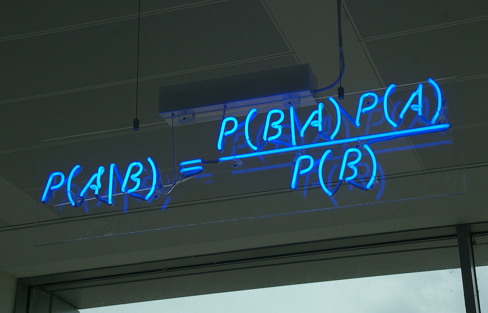

# Bayes' Theorem {#chbayes}

```{marginfigure}
Gardner attributes the quoted sentiment to [Charles Sanders Peirce](https://en.wikipedia.org/wiki/Charles_Sanders_Peirce). The source in Peirce's writings is unknown.
```

> *...in no other branch of mathematics is it so easy for experts to blunder as in probability theory.*
>
> `r quote_footer('---Martin Gardner')`

`r newthought("In a famous")` psychology experiment, subjects were asked to solve the following problem.

```{block, type='problem'}
A cab was involved in a hit and run accident at night. Two cab companies, the Green and the Blue, operate in the city. You are given the following data:

1.  $85\%$ of the cabs in the city are Green and $15\%$ are Blue.
2.  A witness identified the cab as Blue. The court tested the reliability of the witness under the same circumstances that existed on the night of the accident and concluded that the witness correctly identified each one of the two colors $80\%$ of the time and failed $20\%$ of the time.

What is the probability that the cab involved in the accident was blue rather green?
```

Most people answer $80\%$, because the witness is $80\%$ reliable. But the right answer is $12/29$, or about $41\%$.

How could the probability be so low when the witness is $80\%$ reliable? The short answer is: because blue cabs are rare. So most of the time, when the witness says a cab is blue, it's one of the $20\%$ of green cabs they mistakenly identify as blue.

But this answer still needs some explaining. Let's use a diagram.

```{r echo=FALSE, fig.margin=TRUE, fig.cap="The green cab/blue cab problem. Most blue cabs are correctly identified \"blue\", and most green cabs are correctly identified \"green\". But most of the cabs identified \"blue\" are actually green."}
taxi_blue <- readPNG("img/taxi_blue.png") %>% rasterGrob()
taxi_green <- readPNG("img/taxi_green.png") %>% rasterGrob()

place_image <- function(row, img) {
  annotation_custom(img, xmin = row[1], xmax = row[1] + 1, 
                    ymin = row[2] + .1, ymax = row[2] + .9)
}

green_grid <- bind_rows(
  expand.grid(x = 0:9, y = 0:6),
  expand.grid(x = 5:9, y = 7:9)
)
blue_grid <- expand.grid(x = 0:4, y = 7:9)

segments <- bind_rows(
  data.frame(x = 0, y = 2, xend = 0, yend = 10),
  data.frame(x = 0, y = 10, xend = 4, yend = 10),
  data.frame(x = 4, y = 10, xend = 4, yend = 3),
  data.frame(x = 4, y = 3, xend = 1, yend = 3),
  data.frame(x = 1, y = 3, xend = 1, yend = 2),
  data.frame(x = 1, y = 3, xend = 1, yend = 2),
  data.frame(x = 1, y = 2, xend = 0, yend = 2)
)

ggplot() + 
  theme_void() + xlim(0, 10) + ylim(0, 10) +
  apply(green_grid, 1, place_image, taxi_green) +
  apply(blue_grid, 1, place_image, taxi_blue) +
  geom_segment(aes(x = x, y = y, xend = xend, yend = yend),
               data = segments, colour = "blue", size = 1, linetype = "longdash")
```

Imagine there are just $100$ cabs in town, $85$ green and $15$ blue. The dashed blue line represents the cabs the witness identifies as 
"blue", whether right or wrong. Because the witness is $80\%$ accurate, that line encompasses $80\%$ of the blue cabs, which is $12$ cabs. But it also encompasses $20\%$ of the green cabs, which is $17$. That's a total of $29$ cabs identified as "blue", only $12$ of which actually are blue.

So out of the $29$ cabs the witness calls "blue", only $12$ really are blue. The probability a cab really is blue given the witness says so is only $12/29$, about $41\%$.

Another way to think about the problem is that there are *two* pieces of information relevant to whether the cab is blue. The witness says the cab is blue, but also, most cabs are not blue. So there's evidence for the cab being blue, but also strong evidence against it. The diagram helps us see how to balance these two, competing pieces of evidence, to come to the correct answer.

What trips people up so much in the taxicab problem? Remember how order matters with conditional probability. In this problem, we're asked to find $\p(B \given W)$, the probability the cab is blue given that the witness says it is. That's not the same as $\p(W \given B)$, the probability the witness will say the cab is blue if it really is. The problem tells us $\p(W \given B) = 8/10$, but it doesn't tell us a number for $\p(B \given W)$. We have to figure that out.

We saw back in [Chapter 6][Conditional Probability] that $\p(A \given B)$ is usually a different number from $\p(B \given A)$. A university student will probably be young, but a young person will probably not be a university student. That's an example where it's easy to see that order matters. The taxicab example makes it much less obvious, in fact it tempts us to confuse $\p(B \given W)$ with $\p(W \given B)$.


## Bayes' Theorem

`r newthought("Problems where")` we're given $\p(B \given A)$ and we have to figure out $\p(A \given B)$ are extremely common. Luckily, there's a famous formula for solving them.

```{marginfigure}
[Thomas Bayes](https://en.wikipedia.org/wiki/Charles_Sanders_Peirce) (1701--1761) was an English minister and mathematician, the first to formulate the theorem that now bears his name.
```

Bayes' Theorem

:   If $\p(A),\p(B)>0$, then
    $$ \p(A \given B) = \frac{\p(A)\p(B \given A)}{\p(B)}. $$

Notice two things here. First, we need $\p(A)$ and $\p(B)$ to both be positive, because otherwise $\p(A \given B)$ and $\p(B \given A)$ aren't well-defined. Second, we need to know more than just $\p(B \given A)$ to apply the formula. We also need numbers for $\p(A)$ and $\p(B)$.

In the taxicab problem we're given two of the three pieces of information we need. Here's Bayes' theorem for the taxicab example:
$$ \p(B \given W) = \frac{\p(B) \p(W \given B)}{\p(W)}. $$
Whereas the problem gives us the following information:

- $\p(W \given B) = 80/100$.
- $\p(W \given \neg B) = 20/100$.
- $\p(B) = 15/100$.
- $\p(\neg B) = 85/100$.

What's missing for Bayes' Theorem is $\p(W)$. Fortunately, we can calculate it with the Law of Total Probability!
$$
  \begin{aligned}
    \p(W) &= \p(W \given B)\p(B) + \p(W \given \neg B)\p(\neg B)\\
          &= (80/100)(15/100) + (20/100)(85/100\\
          &= 29/100.
  \end{aligned}
$$
And now we have everything we need to plug into Bayes' Theorem:
$$
  \begin{aligned}
    \p(B \given W) &= \frac{\p(B) \p(W \given B)}{\p(W)}\\
                   &= \frac{(15/100)(80/100)}{29/100}\\
                   &= 12/29.
  \end{aligned}
$$
This is the same answer we got with our diagram.

## Understanding Bayes' Theorem

`r newthought("Why does")` Bayes' theorem work? One way to think about it is to start by recalling the definition of conditional probability:
$$ \p(A \given B) = \frac{\p(A \wedge B)}{\p(B)}. $$
Then apply the General Multiplication Rule to the numerator:
$$ \p(A \wedge B) = \p(B \given A)\p(A).$$
And plug that back into the first equation:
$$ \p(A \given B) = \frac{\p(A) \p(B \given A)}{\p(B)}. $$
This proves that Bayes' theorem is correct. But it also suggests a way of understanding it visually, with an Euler diagram.

```{r echo=FALSE, fig.margin=TRUE, fig.cap="An Euler diagram for visualizing Bayes' theorem"}
upper <- function(x) {
  a <- sqrt(1.5^2 - (x[x < 0] - .75)^2)
  b <- sqrt(1.5^2 - (x[x >= 0] + .75)^2)
  c(a,b)
}

ggplot(data.frame(x = c(-3, 3))) + 
  coord_fixed() + theme_void() +
  xlim(-3,3) + ylim(-2,2) +
  geom_circle(aes(x0 = -.75, y0 = 0, r = 1.58), colour = leftcolour, size = 3) +
  geom_circle(aes(x0 = .75, y0 = 0, r = 1.58), colour = rightcolour, size = 3) +
  stat_function(fun = upper, xlim = c(-3/4, 3/4), colour = middlecolour, size = 3) +
  stat_function(fun = function(x) -upper(x), xlim = c(-3/4, 3/4), colour = middlecolour, size = 3) +
  geom_text(aes(x = c(-2.25, 2.25), y = c(1, 1), label = c("A", "B")), 
            fontface = "italic", size = 10, family = "serif") +
  theme(panel.border = element_rect(colour = "black", fill = NA, size = 1))
```

`r newthought("We've talked")` before about $\p(A \given B)$ being the portion of the $B$ region that's inside the $A$ region. The purple portion of the blue $B$ circle, in other words:
$$
  \begin{aligned}
    \p(A \given B) &= \frac{ \color{middlecolour}{\p(A \wedge B)} }{ \color{rightcolour}{\p(B)} }.\\
  \end{aligned}
$$
So when we apply the General Multiplication Rule to the purple region we get:
$$
  \begin{aligned}
    \p(A \given B) &= \frac{ \color{middlecolour}{\p(B \given A)\p(A)} }{ \color{rightcolour}{\p(B)} }.\\
  \end{aligned}
$$

We'll come back to another, non-visual way of making intuitive sense of Bayes' theorem soon, in [Chapter 10][Inference to the Best Explanation].

`r newthought("There are")` lots of other visual explanations of Bayes' theorem you can find online. There's even one [using Legos](https://www.countbayesie.com/blog/2015/2/18/bayes-theorem-with-lego)! But they all tend to come down to the same thing. A two step explanation that goes:

1. Start with the definition of conditional probability, which we learned how to visualize in [Chapter 6][Calculating Conditional Probability].
2. Then apply the General Multiplication Rule, which we learned how to visualize in [Chapter 7][The General Multiplication Rule].

This is a perfectly good and helpful way to think about Bayes' theorem. But it's not really a visualization of the theorem itself, in my opinion. It's two separate visualizations of the ingredients we use to derive the theorem.

But in any case, Bayes' theorem comes up so often it's good to memorize the formula itself. For which the following visualization is probably about as helpful as it gets:

```{r echo=FALSE, fig.cap="Bayes' theorem on display at the offices of HP Autonomy, in Cambridge, UK"}

```


## Bayes' Long Theorem

`r newthought("To solve")` the taxicab problem using Bayes' theorem, we needed to apply the Law of Total Probability first to calculate the denominator. This again is really common. So much so that you'll often see Bayes' theorem written with this calculation built in. That is, the denominator $\p(B)$ is broken down with the Law of Total Probability.

Bayes' Theorem (long version)

:   If $1 > \p(A) > 0$ and $\p(B)>0$, then
    $$ \p(A \given B) = \frac{\p(A)\p(B \given A)}{\p(A)\p(B \given A) + \p(\neg A)\p(B \given \neg A)}. $$

Notice how there's some duplication in the numerator and the denominator. The term $\p(A)\p(B \given A)$ appears both above and below. So, when you're doing a calculation with this formula, you can just do that bit once and then copy it in both the top and bottom. Then you just have to do the bottom-right term to complete the formula.


## Example

`r newthought("Let's")` practice the long form of Bayes' theorem.

```{block, type='problem'}
Joe has just heard about the Zika virus and wonders if he has it. His doctor tells him only $1\%$ of the population has the virus, but he's still worried. There's a blood test he can take, but it's not perfect. The test always comes up either negative or positive, but:

- 95% of people who have the virus test positive.
- 85% of people who don't have the virus test negative.

If Joe tests positive, what is the probability he really has the Zika virus?
```
We're asked to calculate $\p(Z \given P)$, and we're given the following:

- $\p(Z) = 1/100$.
- $\p(P \given Z) = 95/100$.
- $\p(P \given \neg Z) = 15/100$.

So we can calculate $\p(Z \given P)$ using the long form of Bayes' theorem:
$$
  \begin{aligned}
    \p(Z \given P) &= \frac{\p(Z)\p(P \given Z)}{\p(Z)\p(P \given Z) + \p(\neg Z)\p(P \given \neg Z)}\\
                   &= \frac{(1/100)(95/100)}{(1/100)(95/100) + (99/100)(15/100)}\\
                   &= \frac{95}{95 + 1,485}\\
                   &= 19/316\\
                   &\approx .06.
  \end{aligned}
$$
It turns out there's only about a $6\%$ chance Joe has the virus. Even though he tested positive with a fairly reliable blood test! It's counterintuitive, but the reason is the same as with the taxicab problem. There are two, conflicting pieces of evidence: the blood test is positive but the virus is rare. It turns out the virus is so rare that the positive blood test doesn't do much to increase Joe's chances of being infected.

`r newthought("Bayes' theorem")` doesn't always give such surprising results. In fact the results are often very intuitive. Professors just like to use the counterintuitive examples to demonstrate how important Bayes' theorem is. Without it, it's easy to go astray.


## The Base Rate Fallacy

`r newthought("In the")` Zika example, the rate of infection in the general population is very low, just $1\%$. The rate at which something happens in general is called the *base rate*. In the taxicab example, the base rate for blue cabs was $15\%$.

One lesson of this chapter is that you have to take the base rate into account to get the right answer, via Bayes' theorem. Humans have a tendency to ignore the base rate, and focus only on the "test" performed: the blood test in the Zika example, the testimony of the witness in the taxicab example. This mistake is called *base rate neglect*, or *the base rate fallacy*.

The base rate fallacy is so tempting, even trained professionals are susceptible to it. In [one famous study](https://www.stat.berkeley.edu/~aldous/157/Papers/health_stats.pdf), $160$ medical doctors were given a problem similar to our Zika example (but with  cancer instead of Zika). The question was multiple choice, and it used easier numbers than we did. Yet only $34$ of the doctors got it right.

Hence the quote that opens this chapter: "in no other branch of mathematics is it so easy for experts to blunder as in probability theory."


## Exercises {-}


#.  Recall this problem from [Chapter 6](#ch6ex):

    > Five percent of tablets made by the company Ixian have factory defects. Ten percent of the tablets made by their competitor company Guild do. A computer store buys $40\%$ of its tablets from Ixian, and $60\%$ from Guild.

    Use Bayes' theorem to find $\p(I \given D)$, the probability a tablet from this store is made by Ixian, given that it has a factory defect?

#.  Recall this problem from [Chapter 6](#ch6ex):

    > In the city of Elizabeth, the neighbourhood of Southside has lots of chemical plants. $2\%$ of Elizabeth's children live in Southside, and $14\%$ of those children have been exposed to toxic levels of lead. Elsewhere in the city, only $1\%$ of the children have toxic levels of exposure.

    Use Bayes' theorem to find $\p(S \given L)$, the probability that a randomly chosen child from Elizabeth who has toxic levels of lead exposure lives in Southside?

#.  The probability that Nasim will study for her test is $4/10$. The probability that she will pass, given that she studies, is $9/10$. The probability that she passes, given that she does not study, is $3/10$. What is the probability that she has studied, given that she passes?

#.  At the height of flu season, roughly $1$ in every $100$ people have the flu. But some people don't show symptoms even when they have it: only half the people who have the virus show symptoms.

    Flu symptoms can also be caused by other things, like colds and allergies. So about $1$ in every $20$ people who don't have the flu still have flu-like symptoms.

    If someone has flu-like symptoms at the height of flu season, what is the probability that they actually have the flu?

#.  A magic shop sells two kinds of trick coins. The first kind are biased towards heads: they come up heads $9$ times out of $10$ (the tosses are independent). The second kind are biased towards tails: they comes up tails $8$ times out of $10$ (tosses still independent). Half the coins are the first kind, half are the second kind. But they don't label the coins, so you have to experiment to find out which are which.

    You pick a coin at random and flip it twice. Given that it comes up heads both times, what is the probability it's the first kind of coin?

#.  There is a room filled with two types of urns.

    -   Type A urns have $30$ yellow marbles, $70$ red.
    -   Type B urns have $20$ green marbles, $80$ yellow.

    The two types of urn look identical, but $80\%$ of them are Type A. You pick an urn at random and draw a marble from it at random.

    a.  What is the probability the marble will be yellow?

    Now you look at the marble: it is yellow. 

    b.  What is the probability the urn is a Type B urn, given that you drew a yellow marble?

    Suppose now you put the yellow marble back, shake hard, and draw another marble at random from the same urn.

    c.  If this marble is also yellow, what is the probability the
        urn is a Type B urn?
    d.  If this marble is instead green, what is the probability the urn
        is a Type B urn?

#.  In the long form of Bayes' theorem, the denominator is broken down by applying the Law of Total Probability to a partition of two propositions, $A$ and $\neg A$. We can extend the same idea to a partition of three propositions, $X$, $Y$, and $Z$. Here is a start on the formula:

    $$ \p(X \given B) = \frac{\p(X)\p(B \given X)}{\p(X)\p(B \given X) + \;\ldots\;}.$$

    Fill in the rest of the formula, then justify it.

#.  A company makes websites, always powered by one of three server platforms: Bulldozer, Kumquat, or Penguin. Bulldozer crashes $1$ out of every $10$ visits, Kumquat crashes $1$ in $50$ visits, and Penguin only crashes $1$ out of every $200$ visits.

    ```{marginfigure}
    This problem is based on Exercise 6 from p. 78 of Ian Hacking's *An Introduction to Probability & Inductive Logic*.
    ```

    Half of the websites are run on Bulldozer, $30\%$ are run on Kumquat, and $20\%$ are run on Penguin.

    You visit one of their sites for the first time and it crashes. What is the probability it was run on Penguin?

#.  You and Carlos are at a party, which means there's a $2/3$ chance he's been drinking. You decide to experiment to find out: you throw a tennis ball to Carlos and he misses the catch. Five minutes later you try again and he misses again. Assume the two catches are independent.

    When he's sober, Carlos misses a catch only two times out of ten. When he's been drinking, Carlos misses catches half the time.

    What is the probability that Carlos has been drinking, given that he missed both catches?

#.  The Queen Gertrude Hotel has two kinds of suites: singles have one bed, royal suites have three beds. There are $80$ singles and $20$ royals.

    In a single, the probability of bed bugs is $1/100$. But every additional bed put in a suite doubles the chance of bed bugs.

    If a suite is inspected at random and bed bugs are found, what is the probability it's a royal?

#.  Willy Wonka Chocolates Inc. makes two kinds of boxes of chocolates. The "wonk box" has four caramel chocolates and six regular chocolates. The "zonk box" has six caramel chocolates, two regular chocolates, and two mint chocolates. A third of their boxes are wonk boxes, the rest are zonk boxes.

    They don't mark the boxes. The only way to tell what kind of box you've bought is by trying the chocolates inside. In fact, all the chocolates look the same; you can only tell the difference by tasting them.

    a.  If you buy a box, try a chocolate at random, and find that it's caramel, what is the probability you've bought a wonk box?
    b.  If you pick a second chocolate at random and it's caramel too, now what is the probability you've bought a wonk box?

#.  A room contains four urns. Three of them are Type X, one is Type Y.

    -   The Type X urns each contain $3$ black marbles, $2$ white marbles.
    -   The Type Y urn contains $1$ black marble, $4$ white marbles.

    You are going to pick an urn at random and start drawing marbles from it at random *without* replacement.

    a.  What is the probability the urn is Type X if the first draw is black?
    b.  What is the probability the urn is Type X if the first draw is black and the second is white?
    c.  What is the probability the third draw will be black, if the first draw is black and the second is white?
