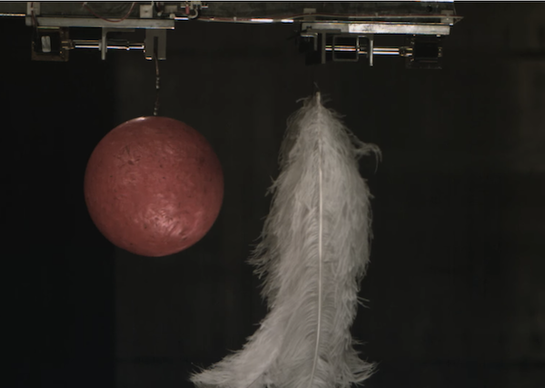
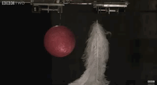

# Probability & Induction


```{block, type="epigraph"}
Nothing in life is to be feared, it is only to be understood.
Now is the time to understand more, so that we may fear less.\
---Marie Curie
```


`r newthought("We")`  met some common types of inductive argument back in [Chapter 2][Forms of Inductive Argument]. Now that we know how to work with probability, let's use what we've learned to sharpen our understanding of how those arguments work.


## Generalizing from Observed Instances

Generalizing from observed instances was the first major form of inductive argument we encountered. Suppose you want to know what colour a particular species of bird tends to be. Then you might go out and look at a bunch of examples:

```{block, type="argument", echo=TRUE}
I've seen $10$ ravens and they've all been black.\
Therefore, all ravens are black.
```

How strong is this argument?

Observing ravens is a lot like sampling from an urn. Each raven is a marble, and the population of all ravens is the urn. We don't know what nature's urn contains at first: it might contain only black ravens, or it might contain ravens of other colours too. To assess the argument's strength, we have to calculate $\p(A \given B_1 \wedge B_2 \wedge \ldots \wedge B_{10})$: the probability that all ravens in nature's urn are black, given that the first raven we observed was black, and the second, and so on, up to the tenth raven.

We learned how to solve simple problems of this form in the [previous chapter][Multiple Draws]. For example, imagine you face another of our mystery urns, and this time there are two equally likely possibilities.
$$
  \begin{aligned}
    A      &= \mbox{The urn contains only black marbles.} \\
    \neg A &= \mbox{The urn contains an equal mix of black and white marbles.} \\
  \end{aligned}
$$
If we do two random draws with replacement, and both are black, we calculate $\p(A \given B_1 \wedge B_2)$ using Bayes' theorem:
$$
  \begin{aligned}
    \p(A \given B_1 \wedge B_2) &= \frac{\p(B_1 \wedge B_2 \given A)\p(A)}{\p(B_1 \wedge B_2 \given A) \p(A) + \p(B_1 \wedge B_2 \given \neg A) \p(\neg A)} \\ 
    &= \frac{(1)^2(1/2)}{(1)^2(1/2) + (1/2)^2(1/2)}\\
    &= 4/5.
  \end{aligned}
$$
If we do a third draw with replacement, and it too comes up black, we replace the squares with cubes. On the fourth draw we'd raise to the fourth power. And so on. When we get to the tenth black draw, the calculation becomes:
$$
  \begin{aligned}
    \p(A \given B_1 \wedge \ldots \wedge B_{10}) &= \frac{(1)^{10}(1/2)}{(1)^{10}(1/2) + (1/2)^{10}(1/2)}\\
    &= 1,024/1,025\\
    &\approx .999.
  \end{aligned}
$$
So after ten black draws, we can be about $99.9\%$ certain the urn contains only black marbles.

But that doesn't mean our argument that all ravens are black is $99.9\%$ strong!


## Real Life Is More Complicated 

There  are two major limitations to our urn analogy.

`r newthought("The first")`  limitation is that the ravens we observe in real life aren't randomly sampled from nature's "urn." We only observe ravens in certain locations, for example. But our solution to the urn problem relied on random sampling. For example, we assumed $\p(B_1 \given \neg A) = 1/2$ because the black marbles are just as likely to be drawn as the white ones, if there are any white ones.

If there are white ravens in the world though, they might be limited to certain locales.^[In fact there are white ravens, [especially in one area of Vancouver Island](https://vancouversun.com/news/local-news/rare-white-raven-spotted-on-vancouver-island).] So the fact we're only observing ravens in our part of the world could make a big difference to what we find. It matters whether your sample really is random.

`r newthought("The second")` limitation is that we pretended there were only two possibilities: either all the marbles in the urn are black, or half of them are. And, accordingly, we assumed there was already a $1/2$ chance all the marbles are black, before we even looked at any of them.

In real life though, when we encounter a new species, it could be that $90\%$ of them are black, or $31\%$, or $42.718\%$, or any portion from $0\%$ to $100\%$. So there are many, many more possibilities. The possibility that *all* members of the new species ($100\%$) are black is just one of these many possibilities. So it would start with a much lower probability than $1/2$.


## The Rule of Succession {#succession}

There is a famous formula that addresses this second issue.
```{marginfigure}
The formula was first derived by [Laplace](#fig:laplace) to solve [the sunrise problem](https://en.wikipedia.org/wiki/Sunrise_problem), the problem of calculating the probability that the sun will rise tomorrow given that it's risen every day so far.
```
Suppose we take all possible compositions of the urn into account: the portion of black balls could be anywhere from $0\%$ to $100\%$. If all these possibilities are equally likely, and we draw randomly with replacement, then the probability the next draw will be black is
$$ \frac{k + 1}{n + 2},$$
where $k$ is the number of black marbles drawn so far, and $n$ is the total number of draws so far. Deriving this formula is a bit tedious so we won't go into it here. We'll settle for understanding it instead.

In our example, we did $10$ draws, all of which came up black. So $n = 10$, and $k = 10$ too. Applying the Rule of Sucession gives us a probability of
$$ \frac{10 + 1}{10 + 2} = \frac{11}{12}, $$
in other words the next draw has about a $0.92$ probability of being black. If we'd only gotten $k = 5$ black marbles out of $n = 10$ draws, the probability would be $6/12 = 1/2$.

Notice though that we've somewhat changed the subject. The Rule of Succession gives us the probability for *one* draw. It doesn't tell us the probability that *all* marbles in the urn are black, it just tells us the probability of getting a black marble if we draw one of them. Analyzing the probability that all the marbles are black is trickier, so we won't go into it. Just be aware that the Rule of Succession gives us individual probabilities, not general ones.

Notice also that the Rule of Succession relies on two assumptions. The first is an assumption we also used earlier, namely that we're sampling randomly. Sometimes this assumption is realistic, but in many real-world applications getting a random sample is tricky, even impossible.

The second assumption is that all possible compositions of the urn are equally likely. It's just as likely that $50\%$ of the marbles are black as that $75\%$ are, or $35.12\%$, or $0.0001\%$. This assumption certainly looks reasonable, at least in some cases. But we'll see in [Chapter 18](#priors) that there are fundamental problems lurking here.

When these assumptions hold though, the Rule of Succession is entirely correct. It just follows from the rules of probability we've already learned. We just need to remember that it would be a mistake to use the Rule of Succession in situations where these assumptions do not apply.


## Inference to the Best Explanation {#bayesibe}

Let's set aside arguments that generalize from observed instances, and focus instead on a different form of inductive argument we met in [Chapter 2][Logic], namely Inference to the Best Explanation. An example:

```{block, type="argument", echo=TRUE}
My car won't start and the gas gauge reads empty.\
Therefore, my car is out of gas.
```

My car being out of gas is a very good explanation of the facts that it won't start and the gauge reads empty. So this seems like a pretty strong argument.

How do we understand its strength using probability? This is actually a controversial topic, currently being studied by researchers. There are different, competing theories about how Inference to the Best Explanation fits into probability theory. So we'll just look at one, popular way of understanding things.

Let's start by thinking about what makes an explanation a good one.

`r newthought("A good")` explanation should account for all the things we're trying to explain. For example, if we're trying to explain why my car won't start and the gauge reads empty, I'd be skeptical if my mechanic said it's because the brakes are broken. That doesn't account for any of the symptoms! I'd also be skeptical if they said the gas gauge was broken. That might fit okay with one of the symptoms (the gauge reads empty), but it doesn't account for the fact the car won't start.

The explanation that my car is out of gas, however, fits both symptoms. It would account for both the empty reading on the gauge and the car's refusal to start.

A good explanation should also fit with other things I know. For example, suppose my mechanic tries to explain my car troubles by saying that both the gauge and the ignition broke down at the same time. But I know my car is new, it's a highly reliable model, and it was recently serviced. So my mechanic's explanation doesn't fit well with the other things I know. It's not a very good explanation.

We have two criteria now for a good explanation:

1. it should account for all the things we're trying to explain, and
2. it should fit well with other things we know.

These criteria match up with terms in Bayes' theorem. Imagine we have some evidence $E$ we're trying to explain, and some hypothesis $H$ that's meant to explain it. Bayes' theorem says:
$$ \p(H \given E) = \frac{\p(H)\p(E \given H)}{\p(E)}. $$
How probable is our explanation $H$ given our evidence $E$? Well, the larger the terms in the numerator are, the higher that probability is. And the terms in the numerator correspond to our two criteria for a good explanation.

1. $\p(E \given H)$ corresponds to how well our hypothesis $H$ accounts for our evidence $E$. If $H$ is the hypothesis that the car is out of gas, then $\p(E \given H) \approx 1$. After all, if there's no gas in the car, it's virtually guaranteed that it won't start and the gauge will read empty. (It's not perfectly guaranteed because the gauge could be broken after all, though that's not very likely.)

2. $\p(H)$ corresponds to how well our hypothesis fits with other things we know. For example, suppose I know it's been a while since I put gas in the car. If $H$ is the hypothesis that the car is out of gas, this fits well with what I already know, so $\p(H)$ will be pretty high.

    Whereas if $H$ is the hypothesis that the gauge and the ignition both broke down at the same time, this hypothesis starts out pretty improbable given what else I know (it's a new car, a reliable model, and recently serviced). So in that case, $\p(H)$ would be low

So the better $H$ accounts for the evidence, the larger $\p(E \given H)$ will be. And the better $H$ fits with my background information, the larger $\p(H)$ will be. Thus, the better $H$ is as an explanation, the larger $\p(H \given E)$ will be. And thus the stronger $E$ will be as an argument for $H$.

What about the last term in Bayes' theorem though, the denominator $\p(E)$? It corresponds to a virtue of good explanations too!

(ref:mooncap1) The hammer/feather experiment was performed on the moon in 1971. See the [full video here](https://bit.ly/1KLQzOB).

(ref:mooncap2) The hammer/feather experiment has also been performed in vacuum chambers here on earth. A beautifully filmed example is [available on YouTube](https://bit.ly/10hw8mP), courtesy of the BBC.

```{r echo=FALSE, cache=TRUE, fig.margin=TRUE, fig.cap=c("(ref:mooncap1)")}

if (knitr:::is_latex_output()) {
  knitr::include_graphics("img/moon.png")
} else {
  
}
```

Scientists love theories that explain the unexplained. For example, Newton's theory of physics is able to explain why a heavy object and a light object, like a hammer and feather, fall to the ground at the same speed as long as there's no air resistance. If you'd never performed this experiment before, you'd probably expect the hammer to fall faster. You'd be surprised to find that the hammer and feather actually hit the ground at the same time. That Newton's theory explains this surprising fact strongly supports his theory.

So the ability to explain surprising facts is a third virtue of a good explanation. And this virtue corresponds to our third term in Bayes' theorem:

```{r echo=FALSE, cache=TRUE, fig.margin=TRUE, fig.cap=c("(ref:mooncap2)")}
if (knitr:::is_latex_output()) {
  
} else {
  
}
```

3. $\p(E)$ corresponds to how surprising the evidence $E$ is. If $E$ is surprising, then $\p(E)$ will be low, since $E$ isn't something we expect to be true. 

And since $\p(E)$ is in the denominator of Bayes' theorem, a smaller number there means a *bigger* value for $\p(H \given E)$. So the more surprising the finding $E$ is, the more it supports a hypothesis $H$ that explains it.

According to this analysis then, each term in Bayes' theorem corresponds to a virtue of a good explanation. And that's why Inference to the Best Explanation works as a form of inductive inference.


## Exercises {-}

#.  The Rule of Succession can look a little strange or mysterious at first. Why is there a $+1$ in the numerator, and a $+2$ in the denominator? To answer these questions, respond to the following.

    a.  According to the Rule of Succession, what is the probability that the first marble drawn will be black? (Hint: in this scenario $k$ and $n$ are the same number, what number?)
    #.  Suppose we do $n$ random draws and half of them are black. According to the Rule of Sucession, what is the probability that the next marble will be black?
    #. Explain why the Rule of Succession has $+1$ in the numerator and $+2$ in the denominator.

#.  The Rule of Succession doesn't just tell us the probability of black on the next draw. The same formula $(k+1)/(n+2)$ applies to any future draw.

    a. Suppose we've done $10$ draws so far and $7$ of them were black. What is the probability that the next two draws will both be black? (Careful: the draws are not independent.)
    #. In general, if we've done $n$ draws and $k$ were black, what is the probability that the next two draws will both be black? Your answer should be a formula in terms of $n$ and $k$.

#.  Instead of the Rule of Succession, statisticians often use the simpler formula $k/n$. This is known as the "maximum likelihood estimate," or MLE.

    a.  According to the MLE, what is the probability that the first marble drawn will be black?
    b.  According to the MLE, if we draw one random marble and it's white, what is the probability the next marble drawn will be black?
    #.  The MLE usually gives different answers than the Rule of Succession. But they do agree in one special case: when half the draws are black, both formulas equal $1/2$. Prove that this is always true.
    #. Although the two formulas usually give different answers, they give very similar answers as long as... (fill in the blank)

#.  Suppose an urn contains a mix of black and white balls. There are two, equally likely possibilities: the ratio of black to white is either $2:1$ or $1:2$. Suppose we do two draws and they are both black.

    a.  What is the probability the next draw will be black?
    #.  Would the Rule of Succession give the same answer? Why or why not?

#.  Suppose we have some evidence $E$ for which we are considering two possible explanations, $H_1$ and $H_2$.

    a.  Suppose $H_1$ and $H_2$ are mutually exclusive and exhaustive, and they fit equally well with our background information. But $H_1$ fits the evidence $E$ better than $H_2$ does. Prove that $\p(H_1 \given E) > \p(H_2 \given E)$.
    #.  Suppose $H_1$ and $H_2$ fit equally well with our background information, but they are not mutually exclusive or exhaustive. As before, $H_1$ fits the evidence $E$ better than $H_2$. Prove that $\p(H_1 \given E) > \p(H_2 \given E)$.
    #.  Suppose the two explanations fit the evidence $E$ equally well, but $H_1$ fits better with our background information. Prove that $\p(H_1 \given E) > \p(H_2 \given E)$.

#.  Suppose we flip a coin $3$ times. Our evidence $E$ is that it lands heads, tails, heads. Now consider two possible explanations.

    - $H_1$: the coin is fair.
    - $H_2$: the coin is biased toward heads, with a $2/3$ chance of heads on each toss (the tosses are independent).

    Suppose these are the only two possibilities, and they fit equally well with our background information.

    a.  How well does each hypothesis fit the evidence, $E$? That is, what are $\p(E \given H_1)$ and $\p(E \given H_2)$?
    #.  How probable is each hypothesis given the evidence. In other words, what are $\p(H_1 \given E)$ and $\p(H_2 \given E)$?

#.  Suppose $\p(H \given E) < \p(H)$. When is $\p(E \given H)/\p(E) > 1$ then? Always, just sometimes, or never? Assume all conditional probabilities are well-defined.

#.  Suppose $\p(E \given H) > \p(E)$. When is $\p(H \given E) > 1/2$ then? Assume all conditional probabilities are well-defined.

    a. Always
    #. Just sometimes: when $\p(E) \leq 1/2$.
    #. Just sometimes: when $\p(H) \geq 1/2$.
    #. Never

#.  Consider this statement:

    - If $\p(E \given H) = 1$ and $0 < \p(E) < 1$, then $\p(H \given E) < \p(H)$.
    
    Does this statement always hold? If yes, prove that it does. If no, give a counterexample (draw an Euler diagram where the first two conditions hold but not the third).