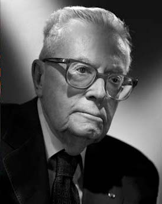
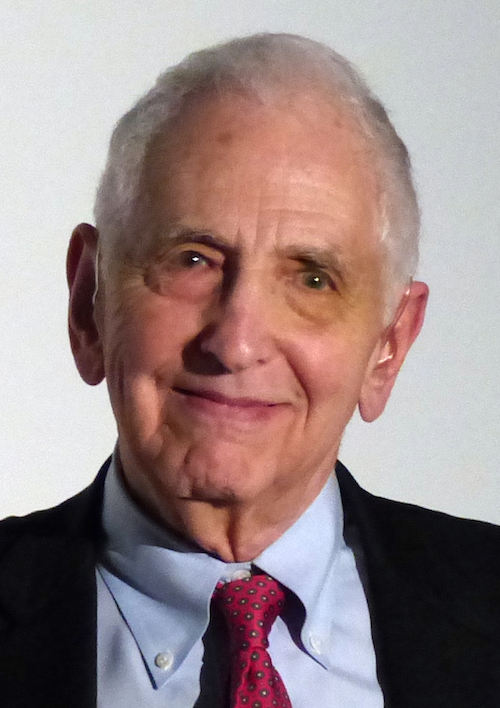

# Challenges to Expected Utility

`r newthought("We've")` learned two key elements of modern decision theory. First, we can quantify people's desires, values, and priorities, a quantity we call *utility*. Second, we should make our decisions according to the expected value formula. We should choose the option with highest *expected utility*.

These ideas have been extremely popular and influential in the last hundred years. But there have also been challenges.


## The Allais Paradox

`r newthought("Suppose")` you have to choose between two options:

- $1A$: $\$1$ million dollars, guaranteed.
- $1B$: a gamble...
    - $1\%$ chance of $\$0$,
    - $89\%$ chance of $\$1$ million,
    - $10\%$ chance of $\$5$ million.

Which would you choose, $1A$ or $1B$? Write your answer down and set it aside, we'll come back to it in a moment.

Now, what if you had to choose instead between these two options:

- $2A$: a gamble...
    - $89\%$ chance of $\$0$,
    - $11\%$ chance of $\$1$ million.
- $2B$: a gamble...
    - $90\%$ chance of $\$0$,
    - $10\%$ chance of $\$5$ million.

`r newthought("Most")`  people choose $1A$ over $1B$ in the first decision. With the safe option of walking away $\$1$ million richer, they don't want to take the chance at $\$5$ million. Even though there's only a $1\%$ risk of walking away empty handed if they take the gamble, it's not worth it to them. The $10\%$ shot at $\$5$ million isn't enough to risk losing out on the guaranteed $\$1$ million.

But in the second decision, most people choose $2B$ over $2A$. There's no safe option now, in fact you'll probably walk away empty handed whatever you choose. Under these circumstances, most people prefer to take on an extra $1\%$ risk of empty-handedness in exchange for a $10\%$ shot at $\$5$ million.

But here's the thing: these choices contradict the expected utility rule! It's not obvious at first. But a few lines of algebra will prove that it's so.

Suppose someone did choose $1A$ over $1B$, and $2B$ over $2A$, by applying the expected utility formula. Then we would know that $\EU(1A) > \EU(1B)$ and $\EU(2B) > \EU(2A)$. In other words:
$$
  \begin{aligned}
    \EU(1A) - \EU(1B) &> 0,\\
    \EU(2A) - \EU(2B) &< 0.
  \end{aligned}
$$
But it turns out that's impossible, because:
$$ \EU(1A) - \EU(1B) = \EU(2A) - \EU(2B). $$
To see why, let's first write out the expected utility formula for each option:
$$
  \begin{aligned}
     \EU(1A) &= \u(\$1M),\\
     \EU(1B) &= .89 \times \u(\$1M) + .1 \times \u(\$5M) + .01 \times \u(\$0M),\\
     \EU(2A) &= .89 \times \u(\$0M) + .11 \times \u(\$1M),\\
     \EU(2B) &= .9 \times \u(\$0M) + .1 \times\u(\$5M).
  \end{aligned}
$$
Now a little arithmetic will show that we get the same result when we subtract the first two formulas and the second two:
$$
  \begin{aligned}
    \EU(1A) - \EU(1B) &= -.01 \times \u(\$0M) + .11 \times \u(\$1M) - .1 \times \u(\$5M),\\
    \EU(2A) - \EU(2B) &= -.01 \times \u(\$0M) + .11 \times \u(\$1M) - .1 \times \u(\$5M).\\
  \end{aligned}
$$
Notice how both formulas are exactly the same. The difference in expected value between the first two options is exactly the same as the difference in value between the second two options. Which means if you're making decisions using the expected utility rule, you can't prefer the A option in the first decision and the B option in the second.

`r newthought("It's")` important to understand that these calculations don't depend on the utility of money.

In [Chapter 12][Utility] we noted that the difference in utility between $\$0$ and $\$1$ million might be larger for some people than for others. Could these individual priorities explain why some people prefer $1A$ over $1B$ yet $2B$ over $2A$?

No. In the Allais paradox, the way you personally value money is actually irrelevant. It doesn't matter how much you value $\$1$ million vs. $\$0$. Our calculations made no assumptions about the numerical values of $\u(\$0)$, $\u(\$1M)$, and $\u(\$5M)$. We left those terms untouched, treating them as unknown placeholders. Whatever your personal utilities are, there's just no way to prefer $1A$ over $1B$ and $2B$ over $2A$, if you're following the expected utility rule.

```{r echo=FALSE, fig.margin=TRUE, fig.cap="Maurice Allais (1911--2010), photograph by Harcourt Studios"}

```
```{marginfigure}
Leonard Savage (1917--1971) was an American staistician and mathematician, and a leading advocate of the expected utility rule. There doesn't seem to be any public-domain photograph of him available unfortunately, but you can find one [here](http://policonomics.com/leonard-savage/).
```

`r newthought("This")`  challenge is called the *Allais paradox*. Maurice Allais was a French economist, writing at a time when some French thinkers disliked the idea of reducing decisions to a simple equation. The American statistician Leonard Savage, on the other hand, very much liked the idea of expected utility. So Allais cooked up this example to prove Savage wrong.

When Savage first encountered Allais' example, he did exactly what most people do. He chose $1A$ over $1B$, but $2B$ over $2A$. He violated the principles of his own theory!

Savage responded by acknowledging that people are tempted to make exactly the choices Allais predicted. But, he pointed out, people sometimes make irrational choices. And Allais' example brings out our irrational temptations, Savage argued.

To make his case, Savage cast the example in concrete terms. Imagine a random ticket will be drawn from a hat containing tickets numbered $\#1$ through $\#100$. The outcome of each options is determined according to the following table:

```{r echo=FALSE}
df <- data.frame(
    A = c("$1A$", "$1B$", "$2A$", "$2B$"),
    B = c("$1M", "$0", "$1M", "$0"),
    C = c("$1M", "$5M", "$1M", "$5M"),
    D = c("$1M", "$1M", "$0", "$0")
)
colnames(df) <- c("", "$\\#1$", "$\\#2$--$11$", "$\\#12$--$100$")
knitr::kable(df, align = "c", caption = "Savage's version of the Allais paradox, using a lottery with $100$ tickets")
```

In the first row you're guaranteed to get $\$1$ million. In the second row you have a $1\%$ chance of getting nothing, an $89\%$ chance of getting $\$1$ million, and a $10\%$ chance of getting $\$5$ million. And so on.

Viewed this way, we can see that there's no difference between $1A$ and $1B$ if the ticket drawn is one of $\#12$--$100$. And likewise for $2A$ vs. $2B$. So you must choose based on what will happen if the ticket drawn is $\#1$ or one of $\#2$--$11$. In other words, you should ignore the third column and just look at the first two.

But in the first two columns, choosing 1A over $1B$ is the same as choosing $2A$ over $2B$. So, to be consistent, you must choose $2A$ if you chose 1A.

Thus, Savage argued, we can see that the expected utility rule is correct once we frame the problem correctly.

`r newthought("Here's")` another way of thinking about Savage's argument. If you choose $2B$ over $2A$, then you must be willing to accept a $1\%$ chance of getting nothing in exchange for a $10\%$ chance at $\$5$ million. But if you're willing to make that trade, then you should be willing to give up option 1A and take option $1B$ instead.

```{r allais1, echo=FALSE, fig.margin=TRUE, fig.show="hold", fig.cap="A graphical depiction of options $1A$ and $1B$ in the Allais paradox"}
f <- function(x) { case_when(x <= 1 ~ 1) }

ggplot(NULL, aes(c(0, 1))) + 
  stat_function(fun = f, geom = "area", n = 1000, fill = bookblue) +
  scale_y_continuous("", labels = c("0" = "$0", "1" = "$1M", "2" = "$2M", "3" = "$3M", "4" = "$4M", "5" = "$5M"), breaks = seq(0, 5, 1), limits = c(0, 5)) +
  scale_x_continuous("probability", breaks = seq(0, 1, 1/10)) +
  ggtitle("Option 1A")

f <- function(x) { case_when(x <= .01 ~ 0, x <= .9 ~ 1, x <= 1 ~ 5) }

ggplot(NULL, aes(c(0, 1))) + 
  stat_function(fun = f, geom = "area", n = 1000, fill = bookblue) +
  scale_y_continuous("", labels = c("0" = "$0", "1" = "$1M", "2" = "$2M", "3" = "$3M", "4" = "$4M", "5" = "$5M"), breaks = seq(0, 5, 1), limits = c(0, 5)) +
  scale_x_continuous("probability", breaks = seq(0, 1, 1/10)) +
  ggtitle("Option 1B")
```

`r newthought("Visualizing")` the problem is also informative. Figure \@ref(fig:allais1) shows Allais' first choice, between $1A$ and $1B$. Notice how the riskiness of choosing $1B$ is much less noticeable in this format than the potential upside. The $10\%$ chance of winning $\$5$ million jumps right out at you. Whereas the $1\%$ chance of winding up with nothing is barely noticable. 

If you were presented with the Allais choices in this graphical format, instead of with numbers and words, you might choose very differently. Psychologists call this a "framing effect". The way a decision is framed can make a big difference to what people will choose.

Advertisers know a lot about framing effects.


## The Sure-thing Principle

`r newthought("Savage's answer")` to the Allais paradox is based on a famous principle of decision theory:

The Sure-thing Principle

:   If you would choose $X$ over $Y$ if you knew that $E$ was true, and you'd also choose $X$ over $Y$ if you knew $E$ wasn't true, then you should choose $X$ over $Y$ when you don't know whether $E$ is true or not.

How does this principle apply to the Allais paradox? Interpret $E$ this way:

- $E$: One of tickets #$12$--$100$ will be drawn.

Then imagine someone who chos $1A$ over $1B$. Would it make sense for them to choose $2B$ over $2A$?

Well, first imagine they know $E$ is true: they know one of tickets $\#12$--$100$ will be drawn. Then they wouldn't prefer $2B$ over $2A$. They wouldn't care about $2B$ vs. $2A$ because they'll get $\$0$ either way.

Next imagine they know $E$ isn't true: they know one of tickets $\#1$--$11$ will  be drawn instead. Then they still wouldn't prefer $2B$ over $2A$. They chose $1A$ over $1B$, so they prefer not to take a small risk of getting $\$0$ in order to have a chance at $\$5$ million. And that's exactly the same tradeoff they're considering with $2A$ vs. $2B$.

So the Sure-thing Principle says they should choose $2A$ over $2B$ if they chose $1A$ over $1B$. They wouldn't choose $2B$ if they knew $E$ was true, and they wouldn't choose it if they knew $E$ was false. So, even when they don't know whether $E$ is true or false, they should still choose $2A$.


## Prescriptive vs. Descriptive

`r newthought("Some")`  decision theorists use the expected utility formula to *describe* the way people make choices. If you want to predict when people will buy/sell a stock, for example, you might use the expected utility formula to describe what people will do.

But others use the formula to *prescribe* decisions: to determine what we *ought* to do. Sometimes people do what they should, but sometimes they make mistakes or do foolish things.

Savage's answer to the Allais paradox is based on the prescriptive approach to decision theory. According to Savage, people *should* make decisions according to the expected utility formula. But sometimes they don't, as Allais' example demonstrates.


## The Ellsberg Paradox

`r newthought("Here's another")` famous challenge to expected utility and the Sure-thing Principle:

```{block, type='puzzle'}
An urn contains $90$ balls, $30$ of which are red. The other $60$ are either black or white, but the proportion of black to white is not known. A ball will be drawn at random, and you must choose between the following:

- $1A$: win $100 if the ball is red,
- $1B$: win $100 if the ball is black.

You also face a second choice:

- $2A$: win $100 if the ball is either red or white,
- $2B$: win $100 if the ball is either black or white.
```

Most people choose $1A$ over $1B$, since you know what you're getting with $1A$: a $1/3$ chance at the $\$100$. Whereas $1B$ might give worse odds; it may even have no chance at all of winning, if there are no black balls.

At the same time, most people choose $2B$ over $2A$, and for a similar reason. With $2B$ you know you're getting a $2/3$ chance at the $\$100$. While $2A$ might give much worse odds, maybe even as low as $1/3$ if there are no white balls in the urn.

Like in the Allais paradox, this popular combination of choices violates the expected utility rule. The calculation that shows this is pretty similar to the one we did with Allais, so we won't rehearse it here.

(ref:ellsbergcap) Daniel Ellsberg (b. $1931$) is most famous as the leaker of [the Pentagon Papers](https://bit.ly/1Lgsq2D). The 2017 movie [*The Post*](https://bit.ly/2CcHs8v) tells that story, with Ellsberg portrayed by actor Matthew Rhys. (Photograph by Bernd Gross).

```{r echo=FALSE, fig.margin=TRUE, fig.cap="(ref:ellsbergcap)"}

```

Instead let's think about what this puzzle is showing us.


## Ellsberg & Allais

`r newthought("Ellsberg's paradox")` is strongly reminiscent of Allais'. Both exploit a human preference for the known. In the Allais paradox we prefer the sure million, and in the Ellsberg paradox we prefer to know our chances.

But the kind of risk at work in each paradox is different. In the Allais paradox, all the probabilities are known, and in one case we can even know the outcome. If you choose the safe million, you know what your fate will be.

But in the Ellsberg paradox, you never know the outcome. The most you can know is the chance of each outcome. And yet, our preference for the known still takes hold. We still prefer to go with what we know, even when all we can know is the chance of each outcome.

Is this preference for known risks rational? Well, it violates Savage's Sure-thing Principle. View Ellsberg's dilemma as a table:

```{r echo=FALSE}
df <- data.frame(
    A = c("$1A$", "$1B$", "$2A$", "$2B$"),
    B = c("$\\$100$", "$\\$0$",   "$\\$100$", "$\\$0$"),
    C = c("$\\$0$",   "$\\$100$", "$\\$0$",   "$\\$100$"),
    D = c("$\\$0$",   "$\\$0$",   "$\\$100$", "$\\$100$")
)
colnames(df) <- c("", "Red", "Black", "White")
knitr::kable(df, align = "c", caption = "The Ellsberg paradox")
```

If you knew a white ball was going to be drawn, you wouldn't care which option you chose. In the first decision, you'd get $\$0$ either way, and in the second you'd get $\$100$ either way.

And if you knew a white ball wouldn't be drawn, then options 1A and $2A$ would be equivalent. The first two rows are identical to the second two rows, if we ignore the "White" column. So consistency seems to demand selecting $2A$ if you selected 1A.

Most decision theorists find this reasoning compelling. But some turn it on its head. They say: so much the worse for the Sure-thing Principle. The debate has yet to settle into a universal consensus.


## Exercises {-}


#.  Which of the following best describes the Allais paradox? Choose one.

    a.  Most people choose $1B$ over $1A$, and $2B$ over $2A$. But the expected monetary value of $2A$ is greater than the expected monetary value of $2B$.
    b.  Most people choose $1A$ over $1B$, and $2A$ over $2B$. But the expected monetary value of $2B$ is greater than the expected monetary value of $2A$.
    c.  Most people choose $1A$ over $1B$, and $2B$ over $2A$. But $1B$ and $2B$ have greater expected utilities.
    d.  Most people choose $1A$ over $1B$, and $2B$ over $2A$. But it's impossible for the expected utility to be greater for $1A$ than for $1B$ and for $2B$ than for $2A$.

#.  True or false: the usual choices in the Allais paradox conflict with the expected utility rule no matter what utilities we assign to $\$0$, $\$1M$, and $\$5M$.

    a. True
    b. False
    c. Neither

#.  According to Savage's response to the Allais paradox, the rule of expected utility is:

    a. descriptive
    b. prescriptive
    c. both
    d. neither

#.  Which of the following best describes Savage's answer to the Allais paradox? Choose one.

    a.  People value money differently. For some people $\$5$ million is a lot better than $\$1$ million, for others it's only a littler better.
    b.  Expected utility is a descriptive formula, not a prescriptive one. The Sure-thing Principle explains why most peoples' choices are wrong.
    c.  Expected utility is a prescriptive formula, not a descriptive one. The Sure-thing Principle explains why most peoples' choices are wrong.
    d.  Expected utility is only a rough guide. Other factors affect what choice you should make, like whether there is a "safe" (risk-free) option.

#.  In the Allais Paradox, people tend to choose $1A$ over $1B$, but $2B$ over $2A$. This suggests that:

    a. for many people, the utility of $\$5$ million is not five times that of $\$1$ million.
    b. people maximize expected utility, not expected monetary value.
    c. people are more willing to accept a small risk when things are already risky.
    d. the Sure-thing Principle is descriptive, not prescriptive.

#.  In Savage's description of the Allais paradox, we imagine the gambles depending on the random draw of a ticket. When applying the Sure-thing Principle to this analysis...

    a. the unknown event $E$ must be: the ticket drawn is one of $\#12$--$\#100$.
    b. the unknown event $E$ must be: the ticket drawn is one of $\#1$--$\#11$.
    c. the unknown event $E$ can be either as in (a) or as in (b).
    d. None of the above

#.  When applying Savage's Sure-thing Principle to the Ellsberg paradox, which of the following is the unknown event $E$?

    a. The ball drawn is red.
    b. The ball drawn is red or white.
    c. The ball drawn is white.
    d. None of the above

#.  In the Ellsberg Paradox, people tend to choose $1A$ over $1B$, but $2B$ over $2A$. Which of the following does this suggest?

    a. People sometimes violate the Sure-thing Principle.
    b. People don't always maximize expected utility.
    c. People tend to prefer known chances over unknown chances.
    d. All of the above

#. Suppose we don't know what Yu's personal probabilities and utilities are. But we know that she has the following preferences when a card is drawn from a standard deck (not necessarily at random).

    When offered the following two options, Yu prefers B:

    - A: She wins $0 if it's a spade; $2 if it's a club; $0 if it's red.
    - B: She wins $2 if it's a spade; $0 if it's a club; $0 if it's red.

    When offered these two options, Yu prefers D:

    - C: She wins $2 if it's a spade; $0 if it's a club; $5 if it's red.
    - D: She wins $0 if it's a spade; $2 if it's a club; $5 if it's red.

    Which one of the following is correct?

    a. Yu has obeyed the expected utility rule.
    #. Yu has violated the expected utility rule.
    #. The expected utility rule does not apply to Yu's situation.
    #. We don't have enough information to determine whether she has violated the expected utility rule or not.

#. Suppose an urn contains $50$ balls: $25$ are red, the rest are either blue or green in unknown proportion. A random ball will be drawn, and you must choose one of the following.

    - 1A: you win $5 if the ball is red,
    - 1B: you win $5 if the ball is blue.

    You also face a second choice:

    - 2A: you win $5 if the ball is either blue or green,
    - 2B: you win $5 if the ball is either red or green.

    Which one of the following is correct?

    a. Preferring 1B and 2A violates the sure-thing principle.
    #. Preferring 1B and 2A violates the axioms of probability.
    #. Preferring 1A and 2A violates the sure-thing principle.
    #. None of the above.

#. Suppose options $A$ and $B$ depend on a random draw from three tickets. Label the utilities of the possible outcomes as follows:

    |     | $T_1$ | $T_2$ | $T_3$ |
    |-----|-------|-------|-------|
    | $A$ | $a_1$ | $a_2$ | $a_3$ |
    | $B$ | $b_1$ | $b_2$ | $b_3$ |

    According to the Sure-thing principle, you should prefer $A$ to $B$ if (i) you would prefer $A$ to $B$ given either $T_1$ or $T_2$, and (ii) you would prefer $A$ to $B$ given $T_3$. Prove that the expected utility rule agrees.
    
    In other words, assume the following two statements hold:

    - $EU(A) > EU(B)$ if we know the drawn ticket will be either $T_1$ or $T_2$;
    - $EU(A) > EU(B)$ if we know the drawn ticket will be $T_3$.

    Then use those assumptions to show that $EU(A) > EU(B)$.