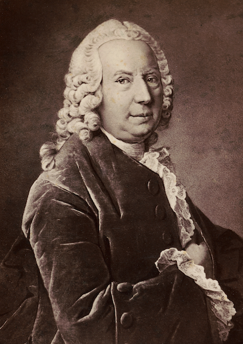
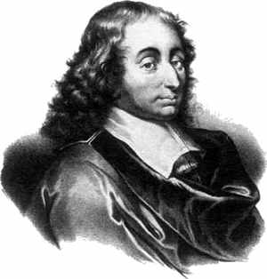

# Infinity & Beyond

`r newthought("Infinity")` poses a different sort of challenge to expected utility, and in this chapter we'll meet two famous examples.


## The St. Petersburg Paradox

`r newthought("Suppose")` I'm going to flip a fair coin, and I'm going to keep flipping it until it lands heads. When it does, the game is over.

- If it comes up heads on the first flip, you win $\$2$.
- If it comes up heads on the second flip, you win $\$4$.
- If it comes up heads on the third flip, you win $\$8$.
- Etc.

How much would you be willing to pay to play this game? Most people aren't willing to pay very much. After all, you probably won't win more than a few dollars. Most likely you'll only win $\$2$ or $\$4$ dollars. The chance you'll win more than say $\$32$ is only about $.03$.

And yet, bizarrely, the expected value of this game is infinite! There's a $1/2$ chance you'll win $\$2$, a $1/4$ chance you'll win $\$4$, a $1/8$ chance you'll win $\$8$, and so on. So:
$$
  \begin{aligned}
    \E(G) &= \p(\$2) \times \$2 + \p(\$4) \times \$4 + \p(\$8) \times \$8 + \ldots\\
          &= (1/2)(\$2) + (1/4)(\$4) + (1/8)(\$8) + \ldots\\
          &= \$1 + \$1 + \$1 + \ldots\\
          &= \$\infty.
  \end{aligned}
$$
And doesn't that mean a fair price for the game would be infinity dollars? So even if you only have a finite bankroll, you should be willing to stake it all to play! 

`r newthought("Visually")`, the St. Petersburg game looks something like Figure \@ref(fig:stp). We can't show every possible outcome, because the payoffs get larger and larger without limit. So we have to cut things off at some point. But we can get the general idea by displaying just the first few possible outcomes. (The rest are shown faded and only partially.)

```{r stp, echo=FALSE, fig.cap="The St. Petersburg game's first seven outcomes. The rest extend off the chart and are shown faded."}
st_petersburg <- function(x) {
  case_when(
    x <= 1/2     ~ 2,
    x <= 3/4     ~ 4,
    x <= 7/8     ~ 8,
    x <= 15/16   ~ 16,
    x <= 31/32   ~ 32,
    x <= 63/64   ~ 64,
    x <= 127/128 ~ 128
  )
}

st_petersburg_overage <- function(x) {
  case_when(
    x <= 127/128 ~ 0,
    x <= 1       ~ 256
  )
}

ggplot(NULL, aes(c(0, 1))) + 
  stat_function(fun = st_petersburg, geom = "area", n = 1000, fill = bookblue) +
  stat_function(fun = st_petersburg_overage, geom = "area", n = 1000, fill = bookblue, alpha = 0.2) +
  scale_y_continuous(breaks = seq(0, 128, 16)) +
  coord_cartesian(ylim = c(0, 128)) +
  xlab("probability") +
  ylab("payoff ($)")
```

As the number of potential flips grows, the rectangles get narrower because the outcomes become less probable. But they also get taller. The payoff doubles every time the probability is cut in half. The result is an infinite sequence of rectangles, each with the same area, namely $1$. So the total area of all the rectangles is infinite.

`r newthought("Most")`  people, when they first encounter this puzzle, try to take the easy way out. "The game is impossible," they say. "Nobody could actually fund this game in real life. No casino has unlimited money, not even the government does. Besides, the coin would wear out after a while. So the house couldn't even guarantee they'd be able to finish the game."

There are two serious problems with this answer. 

First, consider whether you'd be willing to risk your life to play the St. Petersburg game if the casino did have enough cash on hand, and enough coins to keep the game going as long as it takes? Imagine if God descended from heaven and offered to run the game. Would you gamble your life to play then?

Second, even if the game had a finite limit---let's suppose it was $100$ flips---would you be willing to pay $\$100$ to play? The chance you'd make any money at all is less than 1%.

```{r bernoulli, echo=FALSE, fig.margin=TRUE, fig.show="hold", fig.cap="Daniel Bernoulli ($1700$--$1782$)"}

```

## Bernoulli's Solution

`r newthought("The")`  St. Petersburg game was invented by the mathematician Nicolaus Bernoulli in the $18$th Century. He discussed it with his cousin Daniel Bernoulli, who published a famous solution in the *St. Petersburg Academy Proceedings*. (Hence the name of the game.)

His solution: replace monetary value with real value, *utility* in other words. [Recall][Utility] that the more money you have, the less value additional money brings. So even though the payoffs in the St. Petersburg game double from $\$2$ to $\$4$ to $\$8$ etc., the *real* value doesn't double. It grows more slowly.

```{r logutil, echo=FALSE, fig.margin=TRUE, fig.cap="Bernoulli's logarithmic utility function"}
log_utility <- function(x) {
  log(x + 1)
}
ggplot(data.frame(x = c(0, 100))) + 
  stat_function(aes(x), fun = log_utility) +
  xlab("dollars") + ylab("utility")
```

What is the real value of money then? How much utility does a gain of $\$x$ bring? Bernoulli proposed that utility increases "logarithmically" with money. In terms of dollars, $\u(\$x)=\log(x)$. Look at Figure \@ref(fig:logutil) to see what this looks like.

Notice how, for example, $\$16$ doesn't have twice the utility of $\$8$. In fact you have to go all the way up to $\$64$ to get twice the utility of $\$8$. That's because $64 = 8^2$, and logarithms have the property that $\log(a^b) = b \times \log(a)$.

The difference this makes to the St. Petersburg game is displayed in Figure \@ref(fig:logstp). The rectangles don't all have the same area of $1$ anymore, they get smaller instead. In fact, Bernoulli showed that the total area of all the rectangles is only about $1.39$. In other words, the expected utility of the St. Petersburg game is about $1.39$, the equivalent of a $\$4$ gain (because $\log(4) \approx 1.39$).

```{r logstp, echo=FALSE, fig.show="hold", fig.cap="Dollars vs. utils in the St. Petersburg game"}
st_petersburg <- function(x) {
  case_when(
    x <= 1/2     ~ 2,
    x <= 3/4     ~ 4,
    x <= 7/8     ~ 8,
    x <= 15/16   ~ 16,
    x <= 31/32   ~ 32,
    x <= 63/64   ~ 64,
    x <= 127/128 ~ 128
  )
}

st_petersburg_log <- function(x) log(st_petersburg(x))

x <- seq(0, 1-1/2^7, 1/1000)
data <- bind_rows(
  data.frame(x = x, y = st_petersburg(x), unit = "dollars", 
             stringsAsFactors = FALSE),
  data.frame(x = x, y = st_petersburg_log(x), unit = "utils", 
             stringsAsFactors = FALSE)
)

ggplot(data) + 
  geom_area(aes(x = x, y = y), fill = bookblue) +
  scale_y_continuous(limits = c(0, 128), breaks = seq(0, 128, 16)) +
  facet_wrap(~unit, scales = "free_y", strip.position = "left",
             labeller = as_labeller(c(dollars = "dollars", utils = "utils"))) +
  ylab(NULL) + xlab(NULL) +
  theme(strip.placement = "outside")
```

So if Bernoulli is right about the utility of money, the fair price for the St. Petersburg game is only about $\$4$. And in fact that's about what most people say they would pay.


## St. Petersburg's Revenge

`r newthought("Unfortunately,")` although Bernoulli was probably right that money decreases in value the more of it you have, that doesn't actually solve the paradox. Because we can just modify the game so that the monetary payoffs grow even faster.

```{marginfigure}

The decimal value of $e$ was used as the key code for a locked room in the *X-Files* episode "Paper Clip" (except they seem to have forgotten the 1). The same scene also references Monty Hall.
```

Instead of the payoffs increasing like this:
$$ \$2, \$4, \$8, \ldots $$
Let's change the game so they increase like this:
$$ \$e^2, \$e^4, \$e^8, \ldots $$
You may remember from math class that $e$ is a special number, approximately equal to $2.71828$. It has the special property that:
$$ \log(e^x) = x. $$
So the utility of winning $\$e^2$ is $\u(\$e^2) = 2$. The utility of winning $\$e^4$ is $\u(\$e^4) = 4$. And so on.

```{r expstp, echo=FALSE, fig.show="hold", fig.margin=TRUE, fig.cap="St. Petersburg's revenge"}
st_petersburg <- function(x) {
  case_when(
    x <= 1/2     ~ 2,
    x <= 3/4     ~ 4,
    x <= 7/8     ~ 8,
    x <= 15/16   ~ 16,
    x <= 31/32   ~ 32,
    x <= 63/64   ~ 64,
    x <= 127/128 ~ 128
  )
}

st_petersburg_overage <- function(x) {
  case_when(
    x <= 127/128 ~ 0,
    x <= 1       ~ 256
  )
}

ggplot(NULL, aes(c(0, 1))) + 
  stat_function(fun = st_petersburg, geom = "area", n = 1000, fill = bookblue) +
  stat_function(fun = st_petersburg_overage, geom = "area", n = 1000, fill = bookblue, alpha = 0.2) +
  scale_y_continuous(breaks = seq(0, 128, 16)) +
  coord_cartesian(ylim = c(0, 128)) +
  xlab("probability") +
  ylab("utils")
```

Now the utilities are the same as the dollar payoffs were in the original version of the game:
$$ 2, 4, 8, \ldots $$
So the expected *utility* is the same as the expected monetary value of the original game, namely infinite:
$$
  \begin{aligned}
     \E(G) &= \p(\$e^2) \u(\$e^2) + \p(\$e^4) \u(\$e^4) + \p(\$8) \u(\$e^8) + \ldots\\
          &= (1/2)(2) + (1/4)(4) + (1/8)(8) + \ldots\\
          &= 1 + 1 + 1 + \ldots\\
          &= \infty.
  \end{aligned}
$$

So, once again, you should be willing to give anything to play. Or so the expected utility rule seems to demand.^[Still worried there's not enough money in the world to guarantee this game? Try another variation. Imagine God offers to substitute days in heaven for dollars. Unlike dollars, days in heaven don't lose value the more you have.]

`r newthought("What's the right solution")` to the St. Petersburg paradox then? Nobody knows, really. Once infinities get involved, the whole expected value framework seems to go off the rails.

Some decision theorists respond by insisting that there's a finite limit on utility. There's only so good an outcome can be, they say.

But others don't find this response plausible. There may be a limit on how much good you can get out of money, because there's only so much money can buy. But money is only a means to an end, a medium we can exchange for the things we really want---things of intrinsic value like pleasure, happiness, beauty, and love. Is there really a finite limit on how much value these things can bring into the world? If so, what is that limit, and why?


## Pascal's Wager

```{r echo=FALSE, fig.margin=TRUE, fig.cap="Blaise Pascal ($1623$--$1662$)"}

```

`r newthought("The")`  modern theory of probability has a curious origin. It started with Blaise Pascal, a French mathematician and philosopher living in the $1600$s. Pascal had a friend who has an avid gambler, and who came to him for advice on gambling problems. Pascal discussed these problems in letters with another famous mathematician, Pierre de Fermat. Out of their correspondence, the concept of expected value was born.

Pascal was a devout Catholic. So, once he developed the tools of decision theory, he applied them to religious questions. Like: is it rational to believe in God?

Pascal realized he could think of this question as a decision problem. If God exists, then believing gets you into heaven, which is very good. Whereas not believing gets you a one-way ticket to hell, which is terribly bad. So believing in God looks like the better option.

But Pascal also realized that probabilities matter as much as the potential payoffs when making decisions. Playing the lottery might win you millions, but the odds are very poor. So spending your money on a cup of coffee might be the smarter choice.

Likewise, believing in God might be such a long shot that it's not worth it, even if the potential payoff of heaven is fantastic. Of course, Pascal himself already believed in God. But he wanted to convince others to do the same, even if they thought it very unlikely that God exists.

The potential payoff of believing in God is special though, Pascal realized: it's not just very good, it's *infinitely* good. If you believe in God and you're right, you go to heaven for eternity, a neverending existence of pure ecstacy. Whereas if you don't believe in God and you're wrong, the payoff is infinitely bad: an eternity in hell.

So Pascal figured the decision problem looks something like this:

```{r wager2x2, echo=FALSE}
df <- data.frame(
    A = c("Believe", "Don't Believe"),
    B = c("$+\\infty$", "$-\\infty$"),
    C = c("$-10$", "$+10$")
)
colnames(df) <- c("", "God Exists", "God Doesn't Exist")
knitr::kable(df, align = "c", caption = "Pascal's Wager")
```

The $-10$ in the top-right cell is somewhat arbitrary. There's some finite cost to believing in God if he doesn't exist. People generally prefer to believe the truth. And if there's no God, many people would prefer not to spend their time and energy on religious matters. But is $-10$ a good representation of these losses?

It doesn't matter, as it turns out. Whether we use $-10$, $-20$, or any other finite number for those losses, it ends up getting drowned out by the $+\infty$ in the neighbouring cell. And likewise for the $+10$ in the bottom-right (which represents the value of being right about God's existence, and maybe also of living life your own way).

Why do these finite values not matter in the end? How do they get drowned out?

Well, said Pascal, even atheists must admit that there's some small chance God exists. Nobody can be 100% sure there is no God. So when we calculate the expected utility of believing in God, we get the following result:
$$
  \begin{aligned}
    \E(\mbox{Believe}) &= \p(G) \times \infty + \p(\neg G) \times -10\\
                       &= \infty - \mbox{something finite}\\
                       &= \infty.
  \end{aligned}
$$
As long as $\p(G)$ is some positive number, multiplying it by $\infty$ results in $\infty$. No matter how small a number is, adding it to itself infinitely many times results in an infinite quantity. No matter how small your steps, if you take infinitely many of them, you can travel any distance.

Also, $\infty$ minus any finite quantity is still $\infty$. If I start with an infinite collection of objects, say an infinite list of numbers for example:
$$ 1, 2, 3, 4, 5, \ldots $$
and I remove finitely many of them, say the numbers $1$ throught $10$, I'm still left with an infinite list:
$$ 11, 12, 13, 14, 15, \ldots $$
Therefore, Pascal argued, believing in God has infinite expected value.

What about not believing? It has infinitely negative expected value:
$$
\begin{aligned}
    \E(\mbox{Don't Believe}) &= \p(G) \times -\infty + \p(\neg G) \times 10\\
                             &= -\infty + \mbox{something finite}\\
                             &= -\infty.
  \end{aligned}
$$
So believing in God is an infinitely better decision than not believing! Or so Pascal thought.


## Responses to Pascal's Wager

`r newthought("Some")`  people criticized Pascal's argument on the grounds that belief is not a decision. Whether you believe in something isn't voluntary, like deciding what shirt to wear in the morning. You can't just decide to believe in God, you can only believe what seems plausible to you based on what you know.

But, Pascal famously replied, you can decide how you spend your days. And you can decide to spend them  with religious people, reading religious books, and going to a house of worship. So you can decide to take steps that will, eventually, make you a believer. And since believing is so much better than not, that's how you should spend your days.

`r newthought("A")`  more serious problem with Pascal's argument is known as *the many gods* problem.

In Pascal's day, in France, Catholicism dominatd the religious landscape. So for him, believing in God just meant believing in *Catholicism's* conception of God. But there are many possible gods besides the Catholic god, like the god of Islam, the god of Judaism, the gods of Hinduism, and so on.

What happens if you choose the wrong God? You might go to hell! The god of Mormonism might send you to hell for believing in Catholicism, for example. There might even be an anti-Catholic god, who sends all Catholics to hell and everyone else to heaven!

So the correct decision table looks more like this:

```{r manygods, echo=FALSE}
df <- data.frame(
    A = c("Believe Catholic", "Believe Anti-Catholic", "$\\vdots$", "Don't Believe"),
    B = c("$+\\infty$", "$-\\infty$", "$\\vdots$", "$-\\infty$"),
    C = c("$-\\infty$", "$+\\infty$", "$\\vdots$", "$+\\infty$"),
    D = c("...", "...", "$\\ddots$", "..."),
    E = c("$-10$", "$-10$", "$\\vdots$", "$+10$")
)
colnames(df) <- c("", "Catholic God Exists", "Anti-Catholic God Exists", "...", "No God Exists")
knitr::kable(df, align = "c", caption = "Pascal's Wager with many gods. The ... stands in for the many different gods that might exist, each of which has its own column. There is also a row for each of these possible gods, since we have the option to believe in that god.")
```

What's the expected utility of believing in the Catholic god now? It turns out there's no answer! The calculation comes out undefined:
$$
  \begin{aligned}
  \E(\mbox{Believe Catholic}) %
    &= \p(\mbox{Catholic})\u(\mbox{Catholic}) +%
       \p(\mbox{Anti-Catholic})\u(\mbox{Anti-Catholic}) + \ldots\\
    &= \p(\mbox{Catholic}) \times \infty + \p(\mbox{Anti-Catholic}) \times%
        -\infty + \ldots\\
    &= \infty - \infty + \ldots\\
    &= \mbox{undefined}
  \end{aligned}
$$
Why is this undefined? Why isn't $\infty - \infty = 0$? Because taking an infinite quantity away from an infinite quantity can result in any quantity left over.

Imagine we start with an infinite list, a list of all the counting numbers for example:
$$ 1, 2, 3, 4, 5 \ldots $$
Now remove all the even numbers from that list. There's still an infinite list of numbers remaining:
$$ 1, 3, 5 \ldots $$
After removing an infinite quantity from an infinite quantity, we still have a neverending list left over. So it *looks* at first as though $\infty - \infty = \infty$.

But not so fast! Suppose we start again with all the counting numbers:
$$ 1, 2, 3, 4, 5 \ldots $$
But this time we remove *all* the numbers. Not just the evens, but the odds too. Then there would be nothing left on our list. So now it looks like $\infty - \infty = 0$ instead of $\infty$!

The moral: there are many ways to take an infinite quantity away from an infinite quantity. Some of these leave an infinite quantity remaining. Others leave nothing remaining. There are still others that would leave just one, two, or three items remaining. (Can you think of your own examples here?)

So $\infty - \infty$ is not a well-defined quantity. 

`r newthought("The")`  expected value framework doesn't seem to work well when infinities show up. The St. Petersburg problem gave us similar trouble. Researchers are still trying to figure out how to make decisions that involve infinite quantities.


## Exercises {-}

#. In the St. Petersburg game, what is the probability of winning $\$16$ or less?

    a. $1/16$
    b. $1/2$
    c. $7/8$
    d. $15/16$

#. Suppose we modify the St. Petersburg game by capping the number of flips at $50$: if the coin lands tails $50$ times in a row, the game is over and you win nothing. What is the expected *monetary* value of this game?

    a. $\$25$
    b. $\$50$
    c. $\$100$
    d. $\$2^{50}$

#.  According to Daniel Bernoulli's solution to the St. Petersburg paradox, the utility of the coin landing heads on the $(n+1)$-th flip isn't twice that of landing on the $n$-th flip, because...

    a. when the payouts get very large, it becomes less and less likely you'll actually be paid the amount promised.
    b. the longer the game goes on, the greater the chance it will be interrupted before the $(n+1)$-th flip can happen.
    c. infinity isn't a real number.
    d. the more money you have, the less value additional money adds.

#.  According to Daniel Bernoulli, the utility of $\$2x$ is not twice that of $\$x$ because utility is logarithmic: $U(\$x) = \log (\$x)$. So the expected monetary value of the St. Petersburg game may be infinite, but its expected utility is finite.

    In the text we discussed one reason this doesn't resolve the paradox. What was the reason?

    a. It's not very plausible that utility is logarithmic.
    b. Even on a logarithmic scale, the expected utility is still infinite.
    c. Even if Bernoulli is right, the expected monetary value is still infinite.
    d. The paradox appears all over again when we double the utilities instead of the dollar amounts.

#. Some people respond to the St. Petersburg paradox by arguing that there's a limit on how good an outcome can be. Utilities have an upper bound, they say.

    Bernoulli's logarithmic utility function does not have an upper bound. In other words: for any real number $y$, no matter how large, there is some real number $x$ such that $\log(x) = y$. Give a formula for $y$ in terms of $x$. In other words, what is the function $f$ such that $x = f(y)$, if $y = \log(x)$?

#.  Consider the first form of Pascal's Wager, displayed in Table \@ref(tab:wager2x2). What is the expected utility of believing in God if the probability God exists is $0$?

    a. $-10$
    b. $0$
    c. $\infty$
    d. Undefined

#. Consider the first form of Pascal's Wager, displayed in Table \@ref(tab:wager2x2).  Suppose the probability God exists is almost zero, but not quite: one in ten trillion. What is the expected utility of believing in God?

    a. $\infty$
    b. $-\infty$
    c. $0$
    d. one in ten trillion

#.  According to the many gods objection, Pascal’s Wager argument fails to account for the possibility of other gods besides the Catholic conception. What happens to Pascal’s decision table when other gods are included? Circle one answer.

    a.  The expected utilities can’t be calculated because there are infinitely many possible Gods.
    b.  The expected utilities can’t be calculated because you can’t subtract $\infty$ from $\infty$.
    c.  The expected utilities can’t be calculated because we don’t know the probabilities.
    d.  The expected utility of believing in God ends up being the same as the expected utility of not believing in God.

#. Consider the "many gods" version of Pascal's Wager, displayed in Table \@ref(tab:manygods). What is the expected utility of believing in Catholicism?

    a. $\infty$
    b. $-\infty$
    c. Undefined
    d. $0$

#. Suppose an atheist responds to Pascal's Wager as follows: "Belief isn't something we choose. I can't just decide to believe in God any more than you can decide to believe unicorns exist."

    How would Pascal reply?

    a. Belief *is* a choice when it comes to abstract questions, like the existence of God. Because such questions can't be settled by just looking and seeing.
    b. Belief *is* a choice when it comes to questions where the evidence is conflicting. And the evidence for/against God's existence does conflict.
    c. Maybe you can't control what you believe (descriptive), but it's still true that you *should* believe (normative).
    d. Maybe you can't control what you believe directly. But you can influence your beliefs indirectly, by choosing how and where you spend your time.

#.  Explain why the expected utility of believing in God is undefined in Pascal's Wager, if we include other possible gods like the "anti-Catholic" god.

    Write your answer using complete sentences. You can include equations, tables, or diagrams, but you must explain what they mean in words. Your answer should include an explanation why $\infty - \infty$ is undefined.