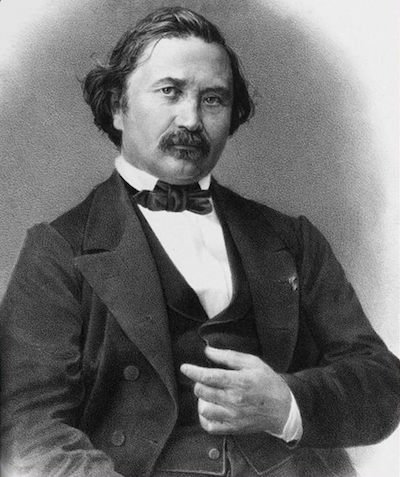
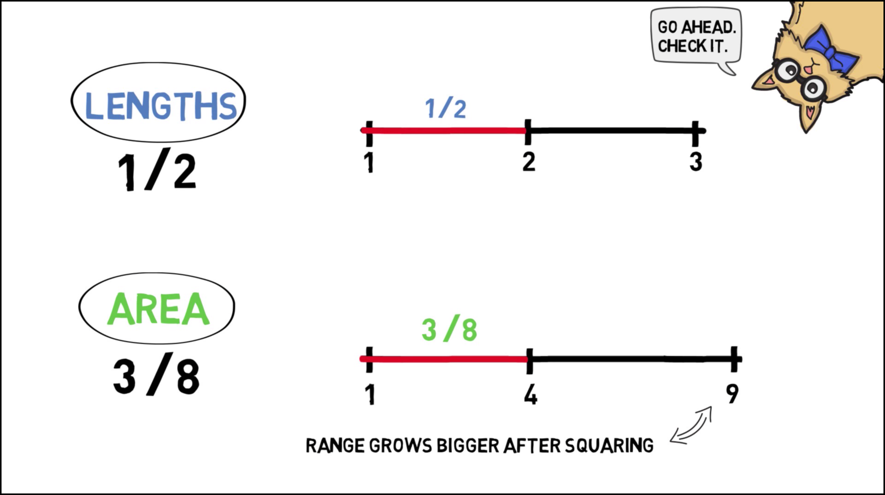

# The Problem of Priors {#priors}

```{block, type="epigraph"}
When my information changes, I alter my conclusions.
What do you do, sir?\
---attributed to John Maynard Keynes
```

`r newthought("The")`  last two chapters showed how Bayesians make personal probabilities objective. They can be quantified using betting rates. And they are bound to the laws of probability by Dutch books.

But what about learning from evidence? Observation and evidence-based reasoning are the keystones of science. They're supposed to separate the scientific method from other ways of viewing the world, like superstition or faith. So where do they fit into the Bayesian picture?


## Priors & Posteriors

`r newthought("When")`  we observe something new, we change our beliefs. A doctor sees the results of her patient's lab test and concludes he doesn't have strep throat after all, just a bad cold.

In Bayesian terms, the beliefs you have before a change are called your ***priors***. We denote your prior beliefs with the familiar operator $\pr$. Your prior belief about hypothesis $H$ is written $\p(H)$. The new beliefs you form based on the evidence are called your ***posteriors***. We write $\po$ to distinguish them from what you believed before. So $\po(H)$ is your posterior belief in $H$.

What's the rule for changing your beliefs? When you get new evidence, how do you go from $\pr(H)$ to $\po(H)$? Let's start by thinking about an example.

Imagine you're about to test a chemical with litmus paper to determine whether it's an acid or a base. Before you do the test, you think it's probably an acid if the paper turns red, and it's probably a base if the paper turns blue. Suppose the paper turns red. Conclusion: the sample is probably an acid.

So your new belief in hypothesis $H$ is determined by your prior *conditional* belief. Before, you thought $H$ was probably true *if* $E$ is true. When you learn that $E$ in fact is true, you conclude that $H$ is probably true.

Conditionalization

:   When you learn new evidence $E$, your posterior probability in hypothesis $H$ should match your prior conditional probability:
$$ \po(H) = \pr(H \given E). $$

For example, imagine I'm going to roll a six-sided die behind a screen so you can't see the result. But I'll tell you whether the result is odd or even. Before I do, what is your personal probability that the die will land on a high number (either $4$, $5$, or $6$)? Let's assume your answer is $\pr(H) = 1/2$. 

Also before I tell you the result, what is your personal probability that the die will land on a high number *given that it lands on an even number*? Let's assume your answer here is $\pr(H \given E) = 2/3$.

```{r echo=FALSE, fig.margin=TRUE, fig.cap="Prior vs. posterior probabilities in a die-roll problem. $H$ $=$ the die landed $4$, $5$, or $6$. $E$ $=$ the die landed even. $Pr(H) = 1/2$, $Pr^*(H) = 2/3$."}
df <- data.frame(
  outcome = rep(seq(1, 6, 1), 2),
  probability = c(rep(1/6, 6), c(0, 1/3, 0, 1/3, 0, 1/3)),
  hilo = c(rep(" Low", 3), rep(" High", 3), rep(" Low", 3), rep(" High", 3)),
  time = c(rep("Priors", 6), rep("Posteriors", 6))
)

df$time <- factor(df$time, levels = rev(levels(df$time)))

ggplot(df) +
  geom_bar(aes(x = outcome, y = probability, fill = hilo), stat = "identity") +
  facet_grid(cols = vars(time)) +
  scale_y_continuous(limits = c(0, 1), breaks = seq(0, 1, 1/6), 
                     labels = c("0", "1/6", "1/3", "1/2", "2/3", "5/6", "1")) +
  scale_x_continuous(breaks = seq(0, 6, 1),) +
  scale_fill_manual(values = c(bookblue, bookred)) +
  theme(legend.title = element_blank())
```

Now I roll the die and I tell you it did in fact land even. What is your new personal probability that it landed on a high number? Following the Conditionalization rule, $\po(H) = \pr(H \given E) = 2/3$.

`r newthought("We")`  learned how to use [Bayes' theorem][Bayes' Theorem] to calculate $\pr(H \given E)$. If we combine Bayes' theorem with Conditionalization we get:
$$ \po(H) = \pr(H) \frac{\pr(E \given H)}{\pr(E)}. $$
Because this formula is so useful for figuring out what conclusion to draw from new evidence, the Bayesian school of thought is named after it. Bayesian statisticians use it to evaluate evidence in actual scientific research. And Bayesian philosophers use it to explain the logic behind the scientific method.^[We caught a glimpse of this explanation back in [Chapter 15][Bayesianism].]


## The Principle of Indifference

`r newthought("Bayes' theorem")` provides an objective guide for *changing* your personal probabilities. Given the prior probabilities on the right hand side, you can calculate what your new probabilities should be on the left. But where do the prior probabilities on the right come from? Are there any objective rules for determining them? How do we calculate $\pr(H)$, for example?

Let's go back to our example where I roll a die behind a screen. Before I tell you whether the die landed on an even number, it seems reasonable to assign probability $1/2$ to the proposition that the die will land on a high number ($4$, $5$, or $6$). But what if someone had a different prior probability, like $\pr(H) = 1/10$?

That seems like a strange opinion to have. Why would they think the die is so unlikely to land on a high number, when there are just as many high numbers as low ones? On the other hand, if you don't know whether the die is fair, it is possible it's biased against high numbers. So maybe they're on to something. And notice, assigning $\pr(H) = 1/10$ doesn't violate the laws of probability, as long as they also assign $\pr(\neg H) = 9/10$. So we couldn't make a Dutch book against them.

Where do prior probabilities come from then? How do we decide whether to start with $\pr(H) = 1/2$ or $\pr(H) = 1/10$? Here is a very natural proposal:

```{marginfigure, echo=TRUE}
The Principle of Indifference dates back to the very early days of probability theory. In fact [Laplace](#fig:laplace) seems to have thought it was *the* central principle of probability.

For a long time it was known by a different name: "The Principle of Insufficient Reason". The idea was that, without any reason to think one outcome more likely than another, they should all get the same probability.

In $1921$ it was renamed "The Principle of Indifference" by economist John Maynard Keynes ($1883$--$1946$). The idea behind the new name is that you should be indifferent about which outcome to bet on, since they all have the same probability of winning.
```

The Principle of Indifference

:   If there are $n$ possible outcomes, each outcome should have the same prior probability: $1/n$.

In the die example, there are six possible outcomes. So each would have prior probability $1/6$, and thus $\pr(H) = 1/2$:
$$
  \begin{aligned}
    \pr(H) &= \pr(4) + \pr(5) + \pr(6)\\
          &= 1/6 + 1/6 + 1/6\\
          &= 1/2.
  \end{aligned}
$$

Here's one more example. In North American roulette, the wheel has $38$ pockets, $2$ of which are green: zero ($\mathtt{0}$) and double-zero ($\mathtt{00}$). If you don't know whether the wheel is fair, what should your prior probability be that the ball will land in a green pocket?

```{r echo=FALSE, fig.width=5, fig.margin=TRUE, fig.cap="A North American roulette wheel"}
df <- data.frame(
  slot = 1:38,  
  colour = rep(c("R", "B"), 19),
  label = c(0, 28, 9, 26, 30, 11, 7, 20, 32, 17, 5, 22, 34,
            15, 3, 24, 36, 13, 1, "00", 27, 10, 25, 29, 12, 
            8, 19, 31, 18, 6, 21, 33, 16, 4, 23, 35, 14, 2),
  stringsAsFactors = FALSE
)
df$colour[c(1, 20)] <- "G"

ggplot(df) +
  coord_polar(start = -pi/38) +
  geom_tile(aes(x = slot, y = .5), 
            fill = "transparent", colour = "transparent", height = 3) +
  geom_tile(aes(x = slot, y = 2.5, fill = colour), 
            colour = "white", size = .5, height = 1.9) +  
  geom_tile(aes(x = slot, y = 3, fill = colour), 
            colour = "white", size = .5, height = 1) +
  geom_text(aes(x = slot, y = 3, label = label, angle = - 360/38 * slot + 9), 
            colour = "white", fontface = "bold", size = 4) +
  scale_fill_manual(values = c("#383838", "forestgreen", "#dd2825")) +
  theme_void() +  
  theme(legend.position = "none")
```

According to the Principle of Indifference, each space has equal probability, $1/38$. So $\pr(G) = 1/19$:
$$
  \begin{aligned}
    \pr(G) &= \pr(\mathtt{0}) + \pr(\mathtt{00})\\
           &= 1/38 + 1/38\\
           &= 1/19.
  \end{aligned}
$$


## The Continuous Principle of Indifference

`r newthought("So")`  far so good, but there's a problem. Sometimes the number of possible outcomes isn't a finite number $n$, it's a continuum. Suppose you had to bet on the *angle* the roulette wheel will stop at, rather than just the colour it will land on. There's a continuum of possible angles, from $0\deg$ to $360\deg$. It could land at an angle of $3\deg$, or $314.1\deg$, or $100\pi\deg$, etc.

So what's the probability the wheel will stop at, say, an angle between $180\deg$ and $270\deg$? Well, this range is $1/4$ of the whole range of possibilities from $0\deg$ to $360\deg$. So the natural answer is $1/4$. Generalizing this idea gives us another version of the Principle of Indifference. 

Principle of Indifference (Continuous Version)

:   If there is an interval of possible outcomes from $a$ to $b$, the probability of any subinterval from $c$ to $d$ is: $$\frac{d-c}{b-a}.$$

```{r echo=FALSE, fig.margin=TRUE, dev="png", fig.asp = .3, fig.cap="The continuous version of the Principle of Indifference: $Pr(H)$ is the length of the $c$-to-$d$ interval divided by the length of the whole $a$-to-$b$ interval."}
library(grid)
library(pBrackets)
ggplot(NULL) +
  geom_errorbarh(aes(xmin = 0, xmax = 1, y = 0, height = .05)) +
  geom_errorbarh(aes(xmin = .3, xmax = .6, y = 0, height = .05)) +
  geom_text(aes(x = 0,  y = .065, label = "a"), size = 6, fontface = "italic") +
  geom_text(aes(x = 1,  y = .065, label = "b"), size = 6, fontface = "italic") +
  geom_text(aes(x = .3, y = .065, label = "c"), size = 6, fontface = "italic") +
  geom_text(aes(x = .6, y = .065, label = "d"), size = 6, fontface = "italic") +
  geom_text(aes(x = .445, y = -.08, label = "H"), size = 6, fontface = "italic") +
  ylim(-.1, .1) +
  coord_fixed() +
  theme_void()

grid.brackets(298, 89, 160, 89, lwd = 1)
```

The idea is that the prior probability of a hypothesis $H$ is just the proportion of possibilities where $H$ occurs. If the full range of possibilities goes from $a$ to $b$, and the subrange of $H$ possibilities is from $c$ to $d$, then we just calculate how big that subrange is compared to the whole range.


## Bertrand's Paradox

`r newthought("Unfortunately")`, there's a serious problem with this way of thinking. In fact it's so serious that the Principle of Indifference is not accepted as part of the modern theory of probability. You won't find it in a standard mathematics or statistics textbook on probability.

What's the problem? Imagine a factory makes square pieces of paper, whose sides always have length somewhere between $1$ and $3$ feet. What is the probability the sides of the next piece of paper they manufacture will be between $1$ and $2$ feet long?

Applying the Principle of Indifference we get $1/2$:
$$ \frac{d-c}{b-a} = \frac{2-1}{3-1} = \frac{1}{2}. $$
That seems reasonable, but now suppose we rephrase the question. What is the probability that the *area* of the next piece of paper will be between $1$ ft$^2$ and $4$ ft$^2$? Applying the Principle of Indifference again, we get a different number, $3/8$:
$$ \frac{d-c}{b-a} = \frac{4-1}{9-1} = \frac{3}{8}. $$
But the answer should have been the same as before: it's the same questions, just rephrased! If the sides are between $1$ and $2$ feet long, that's the same as the area being between $1$ ft$^2$ and $4$ ft$^2$.

```{r echo=FALSE, cache=TRUE, fig.margin=TRUE, fig.cap="Joseph Bertrand ($1822$--$1900$) presented this paradox in his $1889$ book *Calcul des Probabilités*. He used a different example though. Our example is a bit easier to understand, and comes from the book *Laws and Symmetry* by Bas van Fraassen."}

```

So which answer is right, $1/2$ or $3/8$? It depends on which dimension we apply the Principle of Indifference to: length vs. area. And there doesn't seem to be any principled way of deciding which dimension to use. So we don't have a principled way to apply the Principle of Indifference.

```{marginfigure}
Here's [a video explaining Bertrand's paradox](http://www.wi-phi.com/video/bertrands-paradox) thanks to wi-phi.com:
[](http://www.wi-phi.com/video/bertrands-paradox)
```

`r newthought("There's nothing special")` about the example of the paper factory, the same problem comes up all the time. Take the continuous roulette wheel. Suppose the angle is stops at depends on how hard it's spun. The wheel's starting speed can be anywhere between $1$ and $10$ miles per hour, let's suppose. And if it's between $2$ and $5$ miles per hour, it lands at an angle between $180\deg$ and $270\deg$ degrees. Otherwise it lands at an angle outside that range.

If we apply the Principle of Indifference to the wheel's starting speed we get a probability of $1/3$ that it will land at an angle between $180\deg$ and $270\deg$:
$$ \frac{d-c}{b-a} = \frac{5-2}{10-1} = \frac{1}{3}. $$
But we got an answer of $1/4$ when we solved the same problem before. Once again, what answer we get depends on how we apply the Principle of Indifference. If we apply it to the final angle we get $1/4$, if we apply it to the starting speed we get $1/3$. And there doesn't seem to be any principled way of deciding which way to go.


## The Problem of Priors

`r newthought("There")`  is no accepted solution to Bertrand's paradox.

Some Bayesians think it shows that prior probabilities should be somewhat subjective. Your beliefs have to follow the laws of probability to avoid Dutch books. But beyond that you can start with whatever prior probabilities seem right to you. (The Principle of Indifference should be abandoned.)

Others think the paradox shows that Bayesianism is too subjective. The whole idea of "prior" and "posterior" probabilities was a mistake, say the frequentists. Probability isn't a matter of personal beliefs. There are objective rules for using probability to evaluate a hypothesis, but Bayes' theorem is the wrong way to go about it.

So what's the right way, according to frequentism? The next two chapters introduce the frequentist method.


## Exercises {-}

#.  Suppose a carpenter makes circular tables that always have a diameter between $40$ and $50$ inches. Use the Principle of Indifference to answer the following questions. (Give exact answers, not decimal approximations.)

    a.  What is the probability the next table the carpenter makes will have a diameter of at least $43$ inches?
    #.  What is the probability the next table the carpenter makes will have either a diameter between $41$ and $42$ inches, or between $47$ and $49$ inches?
    #.  Recalculate the probabilities from parts (a) and (b), but this time apply the Principle of Indifference to circumference instead of diameter. Does this change what answers you get?
    #.  Recalculate the probabilities from parts (a) and (b), but this time apply the Principle of Indifference to area instead of diameter. Does this change what answers you get?

#.  Joe spends his afternoons whittling cubes that have a side length between $2$ and $10$ centimetres. Use the Principle of Indifference to answer the following questions. (Give exact answers, not decimal approximations.)

    a.  What is the probability that Joe's next cube will have sides at least $6$ centimetres long?
    #.  What is the probability Joe's next cube will either have sides shorter than $4$ centimetres or longer than $7$ centimetres?
    #.  Recalculate the probabilities from parts (a) and (b), but this time apply the Principle of Indifference to the area of each face, rather than the length of each side. Does this change what answers you get?
    #.  Recalculate the probabilities from parts (a) and (b), but this time apply the Principle of Indifference to volume. Is the result the same or different compared to the answers from parts (a), (b), and (c)?

#.  Joel is in New York and he needs to be in Montauk by $4$:$00$ to meet Clementine. He boards a train departing at $3$:$00$ and asks the conductor whether they'll be in Montauk by $4$:$00$. The conductor says the train will arrive some time between $3$:$50$ and $4$:$12$, but she refuses to be more specific.

    a.  According to the Principle of Indifference, what is the probability that Joel will be in Montauk in time to meet Clementine?

    After thinking it over, Joel realizes that his odds may actually be better than that. It's a $60$ mile trip to Montauk, so the train must travel at an average speed between $a$ and $b$ miles per hour.

    b.  What are $a$ and $b$?
    c.  How fast must the train travel to get to Montauk by $4$:$00$?
    d.  According to the Principle of Indifference, what is the probability that the train will travel fast enough to get to Montauk by $4$:$00$?

#.  A factory makes triangular traffic signs. The height of their signs is always the same as the width of the base. And the base is always between $3$ and $6$ feet.

    a.  According to the Principle of Indifference, what is the probability that the next sign produced will be between $5$ and $6$ feet high?
    b.  Explain how to reformulate the problem in part (a) so that the probability given by the Principle of Indifference changes.
    c.  Explain the challenge that cases like this pose for the theory of personal probability. What do critics of Bayesianism say these examples demonstrate about prior probabilities?

#.  A factory makes circular dartboards whose diameter is always between $1$ and $2$ feet.

    a.  According to the Principle of Indifference, what is the probability that the next dartboard produced will have a diameter between $1$ and $5/3$ feet?
    b.  If we reformulate part (a) in terms of the dartboard’s area, what is the probability given by the Principle of Indifference then? (Reminder: the area of a circle with diameter $d$ is $A = \pi/4 \times d^2$.)
    c.  Explain the challenge that cases like this pose for the theory of personal probability. What do critics of Bayesianism say these examples demonstrate about prior probabilities?

#.  Some bars water down their whisky to save money. Suppose the proportion of whisky to water at your local bar is always somewhere between $1/2$ and $2$. That is, there's always at least $1$ unit of whisky for every $2$ units of water. But there's never more than $2$ units of whisky for every $1$ unit of water. Suppose you order a "whisky".

    a.  According to the Principle of Indifference, what is the probability that it will be mostly whisky? ("Mostly" means more than half.)
    b.  What is the maximum possible proportion water to whisky?
    c.  What is the minimum possible proportion water to whisky?
    d.  Now calculate the probability that your drink will be less than $1/2$ water again, but this time apply the Principle of Indifference to the proportion of water to whisky. Is the result the same or different?