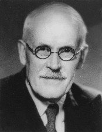

# Lindley's Paradox {#chlindley}

```{block, type="epigraph"}
Another reason for the popularity of statistical significance testing is probably that complicated mathematical procedures lend an air of scientific objectivity to conclusions.\
---Ronald P. Carver
```

`r newthought("Significance")`  testing is all about whether the outcome would be too much of a coincidence for the hypothesis to be true. But how much of a coincidence is too much? Should we reject a hypothesis when we find results that are significant at the $.05$-level? At the $.01$-level?


## Significance & Subjectivity

`r newthought("Critics")`  say this decision is subjective. In the social sciences, researchers have mainly adopted $.05$ as the cutoff, while in other sciences the convention is to use $.01$. But we saw there's nothing special about these numbers. Except that they're easy to estimate without the help of a computer.

It makes a big difference what cutoff we choose, though. The lower the cutoff, the less often a result will be deemed significant. So a lower cutoff means fewer hypotheses ruled out, which means fewer scientific discoveries.

Think of all the studies of potential cancer treatments being done around the world. In each study, the researcher is testing the hypothesis that their treatment has no effect, in the hopes of disproving that hypothesis. They're hoping enough patients get better in their study to show the treatment genuinely helps. If just a few more patients improve with their treatment compared to a placebo, it could just be a fluke. But if a lot more improve, that means the treatment is probably making a real difference.

The lower the significance level, the more patients have to improve before they can call their study's results "significant". So a lower significance level means fewer treatments will be approved by the medical community.

That might seem like a bad thing, but it also has an upside. It means fewer *bogus* treatments being adopted.

```{marginfigure, echo=TRUE}
Medical treatments are often expensive, painful, or dangerous. So it's a serious problem to approve ones that don't actually help.

But sometimes it just leads to [silly dietary choices](https://xkcd.com/882/).
```

After all, occasionally a study of a useless treatment will have lots of patients improving anyway, just by luck. When that happens, the medical community adopts a treatment that doesn't actually work. And there might be lots of studies out there experimenting with treatments that don't actually help. So if we do enough studies, we're bound to get flukey results in some of them, and adopt a treatment that doesn't actually work by mistake.


## Making It Concrete

`r newthought("Suppose")`  for example there are only two types of potential treatment being studied. The useless kind just leave the patient's recovery up to chance: it's a $50\%$ shot. But the effective kind increase their chances of recovery by $15\%$: they have a $65\%$ chance of getting better with these treatments.

Let's also imagine we're studying $200$ different treatments, $160$ of which are actually useless and $40$ of which are effective. Since we don't know which are which, we'll run $200$ studies, one for each treatment. And just to make things concrete, let's suppose each study has $n = 100$ subjects enrolled.

```{r echo=FALSE}
n <- 100
p_missed <- pnorm(60, mean = n * .65, sd = sqrt(n * .65 * .35), lower.tail = FALSE)
p_missed <- round(p_missed, 2)
```

What will happen if our researchers set the cutoff for statistical significance at $.05$? Only a few of the bogus treatments will be approved. Just $5\%$ of those studies will get flukey, statistically significant results. And half of those will look like they're harming patients' chances of recovery, rather than helping. So only $2.5\%$ of the $160$ bogus treatments will be approved, which is $4$ treatments.

But also, a good number of the genuine treatments will be missed. Only about $`r 100 * p_missed`\%$ will be discovered as it turns out: see Figure \@ref(fig:hundredstudies).

```{r hundredstudies, echo=FALSE, cache=TRUE, fig.cap="A significance cutoff of $.05$, when running studies with $100$ patients in each. The red curve represents the probable outcomes when studying useless treatments ($50\\%$ chance of recovery), the green curve represents the probable outcomes when studying effective treatments ($65\\%$ chance of recovery)."}
a <- arrow(length = unit(0.02, "npc"))
yend <- 1.05 * dnorm(65, mean = n * .65, sd = sqrt(n * .65 * .35))

x <- seq(30, 70, .1)
df_useless <- data.frame(
  x = x,
  y = dnorm(x, mean = n * .5, sd = sqrt(n * .25))
)
x <- seq(45, 85, .1)
df_effective <- data.frame(
  x = x,
  y = dnorm(x, mean = n * .65, sd = sqrt(n * .65 * .35))
)

ggplot(NULL) +
  geom_path(aes(x = x, y = y), data = df_useless, colour = bookred) +
  geom_path(aes(x = x, y = y), data = df_effective, colour = bookgreen) +
  annotate("segment", x = 40, xend = 40, y = 0, yend = fence_y_end,
           linetype = "dashed", size = .5, colour = "darkgrey") +
  annotate("segment", x = 60, xend = 60, y = 0, yend = fence_y_end,
           linetype = "dashed", size = .5, colour = "darkgrey") +
  annotate("segment", x = 50, xend = 40, y = yend - .002, yend = yend - .002,
           size = .3, colour = "dimgrey", arrow = a) +
  annotate("segment", x = 50, xend = 60, y = yend - .002, yend = yend - .002, 
           size = .3, colour = "dimgrey", arrow = a) +
  annotate("text", x = 50, y = yend, label = "95%", size = 3, 
           colour = "dimgrey") +
  geom_area(aes(x = x, y = y), data = df_useless %>% filter(x >= 60), 
            fill = bookred, alpha = .25) +
  geom_area(aes(x = x, y = y), data = df_effective %>% filter(x <= 60), 
            fill = bookgreen, alpha = .25) +
  annotate("segment", x = 53, xend = 57, y = .015, yend = .01, size = .3, 
           colour = "dimgrey", arrow = a) +
  annotate("text", x = 51, y = .0175, label = "missed discoveries", size = 3, 
           colour = "dimgrey") +           
  annotate("segment", x = 68, xend = 61.5, y = .01, yend = .0025, size = .3, 
           colour = "dimgrey", arrow = a) +   
  annotate("text", x = 68, y = .0125, label = "bogus \"discoveries\"", 
           size = 3, colour = "dimgrey") +        
  xlab(NULL) +
  scale_y_continuous(NULL, labels = NULL)
```

```{r hundredstudiesgrid, echo=FALSE, cache=TRUE, fig.margin=TRUE, fig.cap="The results of our $200$ studies. Green pills represent genuinely effective treatments, red pills represent useless treatments. The dashed green line represents the treatments we approve: only $34$ out of $38$ of these are genuinely effective."}
pill_green <- readPNG("/Users/jweisber/Dropbox/Teaching/VIP/img/pill_green.png") %>% rasterGrob()
pill_red <- readPNG("/Users/jweisber/Dropbox/Teaching/VIP/img/pill_red.png") %>% rasterGrob()

place_image <- function(row, img) {
  annotation_custom(img, xmin = row[1], xmax = row[1] + 1,  ymin = row[2] + .1, ymax = row[2] + .9)
}

green_grid <- expand.grid(x = 0:19, y = 8:9)
red_grid <- expand.grid(x = 0:19, y = 0:7)

path <- bind_rows(
  list(x = 0,  y = 7),
  list(x = 4,  y = 7),
  list(x = 4,  y = 8),
  list(x = 20, y = 8),
  list(x = 20, y = 10),
  list(x = 3,  y = 10),
  list(x = 3,  y = 8),
  list(x = 0,  y = 8),
  list(x = 0,  y = 7)
)

ggplot() + 
  theme_void() + xlim(0, 20) + ylim(0, 10) +
  apply(red_grid, 1, place_image, pill_red) +
  apply(green_grid, 1, place_image, pill_green) +
  geom_path(aes(x = x, y = y), data = path, colour = bookgreen, size = 1, linetype = "longdash")
```


As a result, only about $89\%$ of the treatments we approve will actually be genuinely effective. We can't see this from Figure \@ref(fig:hundredstudies) because it doesn't show the base rates. We have to turn to the kind of reasoning we did in the taxicab problem instead.

Figure \@ref(fig:hundredstudiesgrid) shows the results. Since $2.5\%$ of the $160$ useless treatments (red pills) will be approved, that's $4$ bogus "discoveries". And since $`r 100 * p_missed`\%$ of the $40$ genuine ones (green pills) will be approved, that's about $34$ genuine treatments discovered. So only about $34/38 \approx 89\%$ of our approved treatments actually work.

We could improve this percentage by lowering the threshold for significance to $.01$. But then only half of the genuine treatments would be identified by our studies (Figure \@ref(fig:hundredstudies2)).

```{r hundredstudies2, echo=FALSE, cache=TRUE, fig.cap="A significance cutoff of $.01$ when running studies with $100$ patients in each. The red curve represents the probable outcomes when studying useless treatments ($50\\%$ chance of recovery), the green curve represents the probable outcomes when studying effective treatments ($65\\%$ chance of recovery)."}
a <- arrow(length = unit(0.02, "npc"))
yend <- 1.05 * dnorm(65, mean = n * .65, sd = sqrt(n * .65 * .35))

x <- seq(30, 70, .1)
df_useless <- data.frame(
  x = x,
  y = dnorm(x, mean = n * .5, sd = sqrt(n * .25))
)
x <- seq(45, 85, .1)
df_effective <- data.frame(
  x = x,
  y = dnorm(x, mean = n * .65, sd = sqrt(n * .65 * .35))
)

ggplot(NULL) +
  geom_path(aes(x = x, y = y), data = df_useless, colour = bookred) +
  geom_path(aes(x = x, y = y), data = df_effective, colour = bookgreen) +
  annotate("segment", x = 35, xend = 35, y = 0, yend = yend,
           linetype = "dashed", size = .5, colour = "darkgrey") +
  annotate("segment", x = 65, xend = 65, y = 0, yend = yend,
           linetype = "dashed", size = .5, colour = "darkgrey") +
  annotate("segment", x = 50, xend = 35, y = yend - .002, yend = yend - .002,
           size = .3, colour = "dimgrey", arrow = a) +
  annotate("segment", x = 50, xend = 65, y = yend - .002, yend = yend - .002, 
           size = .3, colour = "dimgrey", arrow = a) +
  annotate("text", x = 50, y = yend, label = "99%", size = 3, 
           colour = "dimgrey") +
  geom_area(aes(x = x, y = y), data = df_useless %>% filter(x >= 65), 
            fill = bookred, alpha = .25) +
  geom_area(aes(x = x, y = y), data = df_effective %>% filter(x <= 65), 
            fill = bookgreen, alpha = .25) +
  annotate("segment", x = 53, xend = 57, y = .015, yend = .01, size = .3, 
           colour = "dimgrey", arrow = a) +
  annotate("text", x = 51, y = .0175, label = "missed discoveries", size = 3, 
           colour = "dimgrey") +           
  annotate("segment", x = 68, xend = 65.5, y = .01, yend = .0002, size = .3, 
           colour = "dimgrey", arrow = a) +   
  annotate("text", x = 69, y = .015, label = "bogus\n\"discoveries\"", 
           size = 3, colour = "dimgrey") +        
  xlab(NULL) +
  scale_y_continuous(NULL, labels = NULL)
```

```{r hundredstudiesgrid2, echo=FALSE, cache=TRUE, fig.margin=TRUE, fig.cap="With a stricter significance cutoff of $.01$, we make fewer \"bogus\" discoveries. But we miss out on a lot of genuine discoveries too."}
green_grid <- expand.grid(x = 0:19, y = 8:9)
red_grid <- expand.grid(x = 0:19, y = 0:7)

path <- bind_rows(
  list(x = 0,  y = 7),
  list(x = 1,  y = 7),
  list(x = 1,  y = 8),
  list(x = 20, y = 8),
  list(x = 20, y = 9),
  list(x = 1,  y = 9),
  list(x = 0,  y = 9),
  list(x = 0,  y = 7)
)

ggplot() + 
  theme_void() + xlim(0, 20) + ylim(0, 10) +
  apply(red_grid, 1, place_image, pill_red) +
  apply(green_grid, 1, place_image, pill_green) +
  geom_path(aes(x = x, y = y), data = path, colour = bookgreen, size = 1, linetype = "longdash")
```

Figure \@ref(fig:hundredstudiesgrid2) shows what happens now: about $95\%$ of our approved treatments will be genuine. We discover half of the $40$ genuine treatments, which is $20$. And $.005$ of the $160$ useless treatments is $.8$, which we'll round up to $1$ for purposes of the diagram. So $20/21 \approx .95$ of our approved treatments are genuinely effective.

But we've paid a dear price for this increase in precision: we've failed to identify half the treatments there are to be discovered. We've missed out on a lot of potential benefit to our patients.

Notice, however, that if bogus treatments were rarer the problem wouldn't be so pressing. For example, Figure \@ref(fig:hundredstudiesgrid3) shows what would happen if half the treatments being studied were bogus, instead of $80\%$. Then we could have stuck with the $.05$ threshold and still had very good results: we would discover about $85$ genuine treatments and only approved about $3$ bogus ones, a precision of about $97\%$.

There are two lessons here. First, lowering the threshold for significance has both benefits and costs. A lower threshold means fewer false discoveries, but it means fewer genuine discoveries too. Second, the base rate informs our decision about how to make this tradeoff. The more false hypotheses there are to watch out for, the stronger the incentive to use a lower threshold.[^drugtrialnote]

[^drugtrialnote]: Is the real base rate low enough that medical researchers actually need to worry? Yes, according to [this research](https://www.doi.org/10.1038/nrd3439-c1).

```{r hundredstudiesgrid3, echo=FALSE, cache=TRUE, fig.margin=TRUE, fig.cap="A significance cutoff of $.05$ does much better if the base rate is more favourable."}
green_grid <- expand.grid(x = 0:19, y = 5:9)
red_grid <- expand.grid(x = 0:19, y = 0:5)

path <- bind_rows(
  list(x = 0,  y = 4),
  list(x = 3,  y = 4),
  list(x = 3,  y = 5),
  list(x = 20, y = 5),
  list(x = 20, y = 10),
  list(x = 15,  y = 10),
  list(x = 15,  y = 9),
  list(x = 0,  y = 9),
  list(x = 0,  y = 4)
)

ggplot() + 
  theme_void() + xlim(0, 20) + ylim(0, 10) +
  apply(red_grid, 1, place_image, pill_red) +
  apply(green_grid, 1, place_image, pill_green) +
  geom_path(aes(x = x, y = y), data = path, colour = bookgreen, size = 1, linetype = "longdash")
```


## The Role of Priors in Significance Testing

`r newthought("Bayesian")`  critics of significance testing conclude that, when we choose where to set the cutoff, we're choosing based on our "priors". We're relying on assumptions about the base rate, the prior probability of the null hypothesis.

So, these critics say, frequentism faces exactly the same subjectivity problem as Bayesianism. Bayesians use Bayes' theorem to evaluate hypothesis $H$ in light of evidence $E$:
$$ \p(H \given E) = \p(H) \frac{\p(E \given H)}{\p(E)} .$$
But we saw there's no recipe for calculating the prior probability of $H$, $\p(H)$. You just have to start with your best guess about how plausible $H$ is. Likewise, frequentists have to start with their best guess about how many of the potential cancer treatments being studied are bogus, and how many are real. That's how we decide where to set the cutoff for statistical significance.

From a Bayesian point of view, significance testing focuses on just one term in Bayes' theorem, the numerator $\p(E \given H)$. We suppose the hypothesis is true, and then consider how likely the sort of outcome we've observed is. But Bayes' theorem tells us we need more information to find what we really want, namely $\p(H \given E)$. And for that, we need to know $\p(H)$, how plausible $H$ is to begin with.

So significance testing is based on a mistake, according to Bayesian critics. It ignores essential [base rate](#baserate) information, namely how many of the hypotheses we study are true. And this can lead to very wrong results, as we learned from the taxicab problem in [Chapter](#chbayes) \@ref(chbayes).

```{r echo=FALSE, cache=TRUE, fig.margin=TRUE, fig.cap="Harold Jeffreys (1891--1989) first raised the problem known as Lindley's paradox in $1939$. Dennis Lindley labeled it a paradox in $1957$, hence the name. It is sometimes called the Jeffreys-Lindley paradox."}

```

This critique of frequentism is sharpened by a famous problem known as Lindley's paradox.


## Lindley's Paradox

```{marginfigure, echo=TRUE}
The tulip example is based on an example from Henry Kyburg's book *Logical Foundations of Statistical Inference*. It also appears in Howson & Urbach's *Scientific Reasoning: A Bayesian Approach*.
```

`r newthought("Suppose")`  a florist receives a large shipment of tulip bulbs with the label scratched off. The company that sent the shipment only sends two kinds of shipments. The first kind contains $25\%$ red bulbs, the second kind has $50\%$ red bulbs.

The two kinds of shipment are equally common. So the store owner figures this shipment could be of either kind, with equal probability.

To figure out which kind of shipment she has, she takes a sample of $48$ bulbs and plants them to see what colour they grow. Of the $48$ planted, $36$ grow red. What should she conclude?

Intuitively, this result fits much better with the $50\%$ hypothesis than the $25\%$ hypothesis. So she should conclude she got the second, $50\%$ kind of shipment. It's just a coincidence that well over half the bulbs in her experiment were red.

But if she uses significance testing, she won't get this result. In fact she'll get an *impossible* result. Let's see how.

```{r echo=FALSE, cache=TRUE, fig.margin=TRUE, fig.cap="The result $k = 36$ out of $n = 48$ is easily statistically significant for the null hypothesis $p = .25$."}
ggplot(data = NULL, aes(x = c(0, 40))) +
  stat_function(fun = dnorm, args = list(mean = 12, sd = 3), n = 201) +
  geom_point(aes(x = 36, y = 0), size = 2) +  
  annotate("text", x = 36, y = .01, label = "italic(k) == 36", size = 4,
           parse = TRUE) +
  xlab("# red bulbs") +
  scale_y_continuous(name = NULL, labels = NULL)
```

Our florist starts by testing the hypothesis that $25\%$ of the bulbs in the shipment are red. She calculates $\mu$ and $\sigma$:
$$
  \begin{aligned}
    \mu &= np = (48)(1/4) = 12,\\
    \sigma &= \sqrt{np(1-p)} = \sqrt{(48)(1/4)(3/4)} = 3.
  \end{aligned}
$$
The $99\%$ range is $12 \pm (3)(3)$, or from $3$ to $21$. Her finding of $k = 36$ is nowhere close to this range, so the result is significant at the $.01$ level. She rejects the $25\%$ hypothesis.

```{r echo=FALSE, cache=TRUE, fig.margin=TRUE, fig.cap="The result $k = 36$ out of $n = 48$ is also statistically significant for the null hypothesis $p = .5$."}
ggplot(data = NULL, aes(x = c(0, 40))) +
  stat_function(fun = dnorm, args = list(mean = 24, sd = 3.464), n = 201) +
  geom_point(aes(x = 36, y = 0), size = 2) +
  annotate("text", x = 36, y = .01, label = "italic(k) == 36", size = 4,
           parse = TRUE) +
  xlab("# red bulbs") +
  scale_y_continuous(name = NULL, labels = NULL)
```

So far so good, but what if she tests the $50\%$ hypothesis too? She calculates the new $\mu$ and $\sigma$:
$$
  \begin{aligned}
    \mu &= np = (48)(1/2) = 24,\\
    \sigma &= \sqrt{np(1-p)} = \sqrt{(48)(1/2)(1/2)} \approx 3.5.
  \end{aligned}
$$
So her result $k = 36$ is also significant at the $.01$ level! The $99\%$ range is $13.5$ to $34.5$, which doesn't include $k = 36$. So she rejects the $50\%$ hypothesis also.

But now she has rejected the only two possibilities. There are only two kinds of shipment, and she's ruled them both out. Something seems to have gone wrong!

How did things go so wrong? Figure \@ref(fig:lindley) shows what's happening here. Neither hypothesis fits the finding $k = 36$ very well: it's an extremely improbable result on either hypothesis. This is why both hypotheses end up being rejected by a significance test.

```{r lindley, echo=FALSE, cache=TRUE, fig.cap="An illustration of Lindley's paradox. The finding $k = 36$ doesn't fit well with either hypothesis, so both are rejected. But it fits one of them (red) much better than the other (blue). So the red hypothesis is more plausible from an intuitive perspective."}
ggplot(data = NULL, aes(x = c(0, 40))) +
  stat_function(fun = dnorm, args = list(mean = 12, sd = 3), n = 201,
                colour = bookblue) +
  stat_function(fun = dnorm, args = list(mean = 24, sd = 3.464), n = 201,
                colour = bookred) +
  geom_point(aes(x = 36, y = 0), size = 2) +
  annotate("text", x = 36, y = .01, label = "italic(k) == 36", size = 4,
           parse = TRUE) +
  xlab("# red bulbs") +
  scale_y_continuous(name = NULL, labels = NULL)
```

But one of these hypotheses still fits the finding much better than the other. The blue curve ($p = .25$) flatlines long before it gets to $k = 36$, while the red curve ($p = .5$) is only close to flatlining. So the most plausible interpretation is that the shipment is half red bulbs ($p = .5$), and it's just a fluke that we happen to have gotten much more than half red in our sample.


## A Bayesian Analysis

`r newthought("Bayesians")`  will happily point out the source of the trouble: our florist has ignored the prior probabilities. If we use Bayes' theorem instead of significance testing, we'll find that the store owner should believe the second hypothesis, which seems right. $36$ red bulbs out of $48$ fits much better with the $50\%$ hypothesis than with the $25\%$ hypothesis.

How do we apply Bayes' theorem in the tulip example? First we label our two hypotheses and the evidence:
$$
  \begin{aligned}
    H      &= \mbox{$25\%$ of the bulbs are red},\\
    \neg H &= \mbox{$50\%$ of the bulbs are red,}\\
    E      &= \mbox{Out of 48 randomly selected bulbs, 36 grew red.}
  \end{aligned}
$$
Because the two kinds of shipment are equally common, the prior probabilities of our hypotheses are:
$$
  \begin{aligned}
    \p(H) &= 1/2,\\
    \p(\neg H) &= 1/2.
  \end{aligned}
$$
So we just need to calculate $\p(E \given H)$ and $\p(E \given \neg H)$. That's actually not so easy, but with the help of a computer we get:
$$
  \begin{aligned}
    \p(E \given H) &\approx 4.7 \times 10^{-13},\\
    \p(E \given \neg H) &\approx 2.5 \times 10^{-4}.
  \end{aligned}
$$
So we plug these numbers into Bayes' theorem and get:
$$
  \begin{aligned}
    \p(H \given E) &= \frac{\p(E \given H)\p(H)}{\p(E \given H)\p(H) + \p(E \given \neg H)\p(\neg H)}\\
        &\approx \frac{(4.7 \times 10^{-13})(1/2)}{(4.7 \times 10^{-13})(1/2) + (2.5 \times 10^{-4})(1/2)}\\
        &\approx .000000002,\\
    \p(\neg H \given E) &= \frac{\p(E \given \neg H)\p(\neg H)}{\p(E \given \neg H)\p(\neg H) + \p(E \given H)\p(H)}\\
        &\approx \frac{(2.5 \times 10^{-4})(1/2)}{(2.5 \times 10^{-4})(1/2) + (4.7 \times 10^{-13})(1/2)}\\
        &\approx .999999998.
  \end{aligned}
$$
Conclusion: the probability of the first hypothesis $H$ has gone way down, from $1/2$ to about $.000000002$. But the probability of the second hypothesis $\neg H$ has gone way up from $1/2$ to about $.999999998$! So we should believe the second hypothesis, not reject it.

According to Bayesian critics, this shows that significance testing is misguided. It ignores crucial background information. In this example, there were only two possible hypotheses, and they were equally likely. So whichever one fits the results best is supported by the evidence. In fact, the second hypothesis is *strongly* supported by the evidence, even though it fits the result quite poorly! Sometimes it makes more sense to [reconcile ourselves to a coincidence than to reject the null hypothesis](https://xkcd.com/1132/).


## Exercises {-}

#. Which of the following statements are true? Select all that apply.

    a. The higher the cutoff for statistical significance, the more true hypotheses will be discovered.
    b. The higher the cutoff for statistical significance, the more false hypotheses will be "discovered".
    c. The higher the cutoff for statistical significance, the more true hypotheses will go undiscovered.
    d. The higher the cutoff for statistical significance, the more false hypotheses will be correctly rejected.

#. Suppose we have $1,000$ coins and we are going to conduct an experiment on each one to determine which are biased. Each coin will be tossed $100$ times. In each experiment, the null hypothesis is always that the coin is fair, and we will reject this hypothesis when the results of the experiment are significant at the $.05$ level.

    Suppose half the coins are fair and half are not. Suppose also that when a coin is unfair, the probability of getting a result that is not statistically significant is $0.2$.

    a. How many fair coins should we expect will incorrectly end up labeled "unfair".
    b. How many unfair coins should we expect will correctly end up labeled "unfair".
    d. What percentage of the coins labeled "unfair" should we expect to actually be unfair? 

#. Suppose we are going to investigate $1,000$ null hypotheses by running an experiment on each. In each experiment, we will reject the null hypothesis when the results are significant at the $.01$ level.

    Suppose $90\%$ of our hypotheses are false. Suppose also that when a null hypothesis is false, the results will not be statistically significant $25\%$ of the time. 

    a. How many false hypotheses should we expect will fail to be rejected?
    b. What percentage of the rejected hypotheses should we expect to actually be false?


#. True or false: it is possible for the results of an experiment to be significant at the $.05$ level even though the posterior probability of the null hypothesis is $\p(H \given E) = .99$.

#.  Suppose there are two types of urns, Type A and Type B. Type A urns contain $1/5$ black balls, the rest white. Type B urns contain $1/10$ black balls, the rest white.

    You have an urn that could be either Type A or Type B, you aren't sure. You think it's equally likely to be Type A as Type B. So you decide to use a significance test to find out.

    Your null hypothesis is that it's a Type A urn. You draw $25$ marbles at random, and $13$ of them are black.

    a.  What are $\mu$ and $\sigma$ in the normal approximation?
    b.  Is the result significant at the $.01$ level for this null hypothesis?
    c.  Suppose our null hypothesis had been instead that the urn is Type B. What would $\mu$ and $\sigma$ be then?
    d.  Is the result significant at the $.01$ level for the Type B hypothesis?

#.  Suppose the government is testing a new education policy. There are only two possibilities: either the policy will work and it will help high school students learn to write better $3/4$ of the time, or it will have no effect and students' writing will only improve $1/2$ of the time, as usual.

    The government does a study of $432$ students and finds that, under the new policy, $285$ of them improved in their writing.

    a.  If the null hypothesis is that each student has a $1/2$ chance of improving, are the results of the study significant at the $.01$ level?
    b.  If the null hypothesis is that each student has a $3/4$ chance of improving, are the results of the study significant at the $.01$ level?

#. Lindley's paradox occurs when a significance test will direct us to reject the hypothesis even though the posterior probability of the hypothesis $\p(H \given E)$ is high. Describe your own example of this kind of case.
