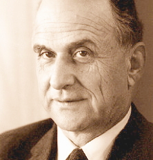
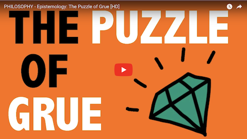

# The Grue Paradox {#grue}

`r newthought("In")` [Section](#indargs) \@ref(indargs) we noticed that many inductive arguments follow this pattern:

```{block, type="argument", echo=TRUE}
All observed instances of $X$ have been $Y$.\
Therefore, all instances of $X$ are $Y$.
```

All observed ravens are black, so we expect all ravens to be black. All observed emeralds are green, so we expect all emeralds to be green. And so on.

So it seems like a fundamental principle of scientific inquiry that we expect the unobserved to resemble the observed. Philosophers call this *The Principle of Induction*.


## A Gruesome Concept {-}

```{r echo=FALSE, cache=TRUE, fig.margin=TRUE, fig.cap="Nelson Goodman (1906--1988) discovered the grue paradox in the $1940$s and '$50$s."}

```

`r newthought("But")`  in the $1940$s, Nelson Goodman discovered a problem with the Principle of Induction. To illustrate the problem he invented a very curious concept, *grue*.

There are two ways for an object to be grue. Some green things are grue, but it depends on when we first encounter them. If our first observation of a green object happens before the year $2050$, then it's grue. So the Statue of Liberty is grue: it's a green object that was first observed before the year $2050$ (*long* before).

But if our first encounter with a green object happens in the year $2050$ or later, then it's not grue. The same goes if we never observe it. Objects on the far side of the universe that we'll never see, or buried deep underground, are not grue.

There is a second way for an object to be grue: some blue objects are grue. Not the ones observed before $2050$, though. Instead it's the ones that *aren't* observed before $2050$. If a blue object is observed for the first time *after* $2049$, or it's never observed at all, then it's grue. So blue sapphires that won't be mined before the year $2050$ are grue, for example.

As usual, it helps to have a diagram:

```{r echo=FALSE, cache=TRUE, fig.cap="The definition of grue"}
df <- expand.grid(
  t_obs = c("Observed Before 2050", "Not Observed Before 2050"),
  colour = c("Green", "Blue")
)
df$colour <- factor(df$colour, levels = rev(levels(df$colour)))
df$green <- c(TRUE, TRUE, FALSE, FALSE)
df$grolour <- c("Grue", "Bleen", "Bleen", "Grue")

ggplot(df) +
  geom_tile(aes(x = t_obs, y = colour, fill = green), colour = "black") +
  geom_label(aes(x = t_obs, y = colour, label = grolour), 
             data = df %>% filter(grolour == "Grue")) +
  theme_minimal() +
  scale_fill_manual(values = c(bookblue, bookgreen)) +
  xlab(NULL) + ylab(NULL) +
  theme(panel.grid = element_blank(), legend.position = "none")
```

Here is the formal definition of grue:

Grue

:    An object is *grue* if either (a) it is green and first observed before the year $2050$, or (b) it's blue and not observed before $2050$.

To test your understanding, see if you can explain why each of the following are examples of grue things: the $\$20$ bill in my pocket, Kermit the Frog, the first sapphire to be mined in $2050$, and blue planets on the far side of the universe.

Then see if you can explain why these things aren't grue: fire engines, the [Star of India](https://en.wikipedia.org/wiki/Star_of_India_(gem)), and the first $\$20$ bill to be printed in $2050$.

Once you've got all those down, try this question: do grue objects change colour in the year $2050$? It's a common mistake to think they do.

But no, grue objects don't change colour. The Statue of Liberty is green and it always will be (let's assume). So it's grue, and always will be, because it's a green thing that was first observed before the year $2050$. Part (a) of the definition of grue guarantees that.

The only way time comes into it is in determining which green things are grue, and which blue things. If a green thing is first observed before $2050$, then it's grue, ever and always. Likewise if a blue thing is *not* first observed before $2050$. Then it's grue---and it always has been!


## The Paradox {-}

`r newthought("Now")`  ask yourself, have you ever seen a grue emerald? You probably have. In fact, every emerald everyone's ever seen has been grue.

Why? Because they're all green, and they've all been observed before the year $2050$. So they're all grue the first way---they all satisfy part (a) of the definition. (Notice it's an either/or definition, so you only have to satisfy one of the two parts to be grue.)

So all the emeralds we've ever seen have been grue. Let's apply the Principle of Induction then:

```{block, type="argument", echo=TRUE}
All observed emeralds have been grue.\
Therefore *all* emeralds are grue.
```

But if all emeralds are grue, then the first emeralds to be mined in $2050$ will be grue. And that means they'll be blue! Because they won't have been observed before $2050$, so the only way for them to be grue is to be blue.

We've reached the absurd conclusion that there are blue emeralds out there, just waiting to be pulled out of the earth. Something has gone off the rails here, but what?

Here's another way to put the challenge. We have two "patterns" in our observed data. The emeralds we've seen are uniformly green, but they're also uniformly grue. We can't project both these patterns into the future, though. They'll contradict each other starting in $2050$.

Now, obviously, common sense says the green pattern is the real one. The grue "pattern" is bogus, and no one but a philosopher would even bother thinking about it. But *why* is it bogus? What's so special about green?

Apparently the Principle of Induction has a huge hole in it! It says to extrapolate from observed patterns. But *which* patterns?


## Grue & Artificial Intelligence {-}

```{r curvefitting, echo=FALSE, cache=TRUE, fig.margin=TRUE, fig.cap="The same set of points interpreted two different ways"}
x <- seq(0, 22, .1)
line <- function(x) x
squiggle <- function(x) 2 * pi * sin(x) + x

df_line <- data.frame(x = x, y = line(x), wiggly = FALSE)
df_squiggle <- data.frame(x = x, y = squiggle(x), wiggly = TRUE)
df <- bind_rows(df_line, df_squiggle)

x <- seq(0, 22, pi)
df_points <- data.frame(x = x, y = line(x))

ggplot(df) +
  geom_point(aes(x = x, y = y), data = df_points) +
  geom_path(aes(x = x, y = y), linetype = "dashed") +
  facet_grid(rows = vars(wiggly)) +
  scale_x_continuous(name = NULL, labels = NULL) +
  scale_y_continuous(name = NULL, labels = NULL) +
  theme(strip.text = element_blank())
```

Patterns are cheap, as any data scientist will tell you. Given a bunch of data points in an *xy*-plane, there are lots of ways to connect the dots. Even if they all lie on a straight line, you could draw an oscillating curve that passes through each point (Figure \@ref(fig:curvefitting)). You can probably think of even sillier curves that will fit all the points.

Designing a computer program that will know which patterns to use and which to ignore is a big part of what machine learning experts do. And it's one reason humans are still essential to designing artificial intelligence. Thanks to our experience, and our genetic inheritance, we have *lots* of information about which patterns are likely to continue, and which are bogus, like grue.

But how do we pass all that wisdom on to the machines? How do we teach them the difference between green and grue, so that they can take it from here and we can all go on permanent vacation? 


## Disjunctivitis {-}

`r newthought("Here's one")` very natural answer. The problem with grue is that it's *disjunctive*: it's defined using either/or. It suffers from what we might call "disjunctivitis".

But the beauty of Goodman's puzzle is the neat way it exposes the flaw in this answer. It allows us to make 'green' the disjunctive concept instead! How? We start by building grue a friend, a concept to fill in the missing spaces in our original diagram. We'll call it *bleen*:

```{r echo=FALSE, cache=TRUE, fig.cap="Defining bleen, a counterpart to grue"}
df <- expand.grid(
  t_obs = c("Observed Before 2050", "Not Observed Before 2050"),
  colour = c("Green", "Blue")
)
df$colour <- factor(df$colour, levels = rev(levels(df$colour)))
df$green <- c(TRUE, TRUE, FALSE, FALSE)
df$grolour <- c("Grue", "Bleen", "Bleen", "Grue")

ggplot(df) +
  geom_tile(aes(x = t_obs, y = colour, fill = green), colour = "black") +
  geom_label(aes(x = t_obs, y = colour, label = grolour), data = df) +
  theme_minimal() +
  scale_fill_manual(values = c(bookblue, bookgreen)) +
  xlab(NULL) + ylab(NULL) +
  theme(panel.grid = element_blank(), legend.position = "none")
```

Now we can define green in terms of grue and bleen:

Green

:   An object is *green* if either (a) it's grue and first observed before the year $2050$, or (b) it's bleen and not observed before $2050$.

Now maybe you're thinking: you *could* define green that way, but that's not how it's *actually* defined. In reality, we already understand the concept of green, and we have to learn the concept of grue from its disjunctive definition.

The problem is, that's just a fact about *us humans*, not about the concepts grue and green. That's just the way we *homo sapiens* happen to be built (or maybe socialized, or both).

Some bizarre species of alien could grow up thinking in grue/bleen terms instead. And when they landed on Earth, we'd have to explain our green/blue language to them using an either/or definition. Then *they* would be looking at *us* thinking: you guys have a very weird, disjunctive way of thinking!

What could we say to them to establish the superiority of our way of thinking? It's been more than $70$ years since Goodman first posed this question. Yet no answer has emerged as the clear and decisively correct one.


## Time Dependence {-}

`r newthought("Another")`  natural answer to Goodman's challenge is to say that grue is defective because it's time-dependent. It means different things depending on the time an object is first observed.

But the same reversal of fortunes that toppled the "disjunctivitis" diagnosis happens here. We can define green in terms of grue and bleen. And when we do, it's green that's the time-dependent concept, not grue.

So we're left in the same spot. We need some way of showing that the "true" order of definition is the one we're used to. By what criterion can we say that green is more fundamental, more basic, than grue?


## The Moral {-}

```{marginfigure}
[](http://www.wi-phi.com/video/puzzle-grue)
For another explanation of the grue puzzle, check out [this excellent Wi-Phi video](http://www.wi-phi.com/video/puzzle-grue).
```

`r newthought("Goodman's puzzle")` may seem just cute at first, a mere curiosity. But it is actually quite profound.

In a way, the central question of this book is: what is the logic of science? What are the correct rules of scientific reasoning?

The laws of probability seem like a good place to start. But that path led us to a dead end at the problem of priors in [Chapter](#priors) \@ref(priors). Perhaps then we could start with the Principle of Induction instead? But then we end up in another dead end, stopped by the grue paradox.

Just as Bertrand's paradox stops us from using the Principle of Indifference to answer the problem of priors, Goodman's paradox stops us from using the Principle of Induction.

There is even more to the similarity between these two paradoxes. Both paradoxes are problems of "language dependence". Depending on what language we work in, rules like the Principle of Indifference and the Principle of Induction give different recommendations. If we apply the Principle of Indifference to length, we get one prior probability; if we apply it to area, we get another. If we apply the Principle of Induction to green, we expect all emeralds to be green; if we apply it to grue, we expect some to be blue.

To this day, we do not have an answer to the question: which language is the right one to use, and why?