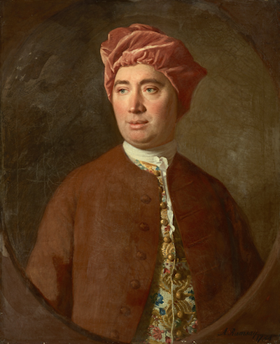

# The Problem of Induction

`r newthought("Many")`  inductive arguments work by projecting an observed pattern onto as-yet unobserved instances. All the ravens we've observed have been black, so all ravens are. All the emeralds we've seen have been green, so all emeralds are.

The assumption that the unobserved will resemble the observed seems to be central to induction. Philosophers call this assumption the *Principle of Induction*.[^poi] But what justfies this assumption? Do we have any reason to think the parts of reality we've observed so far are a good representative of the parts we haven't seen yet?

[^poi]: See [Section](#indargs) \@ref(indargs) and [Appendix](#grue) \@ref(grue) for previous discussions of the Principle of Induction.

Actually there are strong reasons to doubt whether this assumption can be justified. It may be impossible to give any good argument for expecting the unobserved to resemble the observed.


## The Dilemma {-}

`r newthought("We")`  observed previously that there are two kinds of argument, inductive and deductive. Some arguments establish their conclusions necessarily, others only support them with high probability. If there is an argument for the Principle of Induction, it must be one of these two kinds. Let's consider each in turn.

Could we give an inductive argument for the Principle of Induction? At first it seems we could. Scientists have been using inductive reasoning for millenia, often with great success. Indeed, it seems humans, and other creatures too, have relied on it for much longer, and could not have survived without it. So the Principle of Induction has a very strong track record. Isn't that a good argument for believing it's correct?

```{r echo=FALSE, cache=TRUE, fig.margin=TRUE, fig.cap="David Hume (1711--1776) raised the problem of induction in $1739$. Our presentation of it here is somewhat modernized from his original argument."}

```

No, because the argument is circular. It uses the Principle of Induction to justify believing in the Principle of Induction. Consider that the argument we are attempting looks like this:

```{block, type="argument"}
The principle has worked well when we've used it in the past.\
Therefore it will work well in future instances.
```

This is an inductive argument, an argument from observed instances to ones as yet unobserved. So, under the hood, it appeals to the Principle of Induction. But that's exactly the conclusion we're trying to establish. And one can't use a principle to justify itself.

What about our second option: could a deductive argument establish the Principle of Induction? Well, by definition, a deductive argument establishes its conclusion with necessity. Is it necessary that the unobserved will be like the observed? It doesn't look like it. It seems perfectly possible that tomorrow the world will go haywire, randomly switching from pattern to pattern, or even to no pattern at all.

Maybe tomorrow the sun will fail to rise. Maybe gravity will push apart instead of pull together, and all the other laws of physics will reverse too. And just as soon as we get used to those patterns and start expecting them to continue, another pattern will arise. And then another. And then, just as we give up and come to have no expectation at all about what will come next, everything will return to normal. Until we get comfortable and everything changes again.

Thankfully, our universe hasn't been so mischievous. We get surprised now and again, but for the most part inductive reasoning is pretty reliable, when we do it carefully. But we're lucky in this respect, is the point.

Nature *could* have been mischievous, totally unpredictable. It is not a necessary truth that the unobserved must resemble the observed. And so it seems there cannot be a deductive argument for the Principle of Induction. Because such an argument would establish the principle as a necessary truth.


## The Problem of Induction vs. the Grue Paradox {-}

`r newthought("If")`  you read [Appendix](#grue) \@ref(grue), you know of another famous problem with the Principle of Induction: the grue paradox. (If you haven't read that chapter, you might want to skip this section.)

The two problems are quite different, but it's easy to get them confused. The problem we're discussing here is about justifying the Principle of Induction. Is there any reason to believe it's true? Whereas the grue paradox points out that we don't even really know what the principle says, in a way. It says that what we've observed is a good indicator of what we haven't yet obsered. But in what respects? Will unobserved emeralds be green, or will they be grue?

So the challenge posed by grue is to spell out, precisely, what the Principle of Induction says. But even if we can meet that challenge, this challenge will remain. Why should we believe the principle, once it's been spelled out? Neither a deductive argument nor an inductive argument seems possible.


## Probability Theory to the Rescue? {-}

`r newthought("The")`  Problem of Induction is centuries old. Isn't it out of date? Hasn't the modern, mathematical theory of probability solved the problem for us?

Not at all, unfortunately. One thing we learn in this book is that the laws of probability are very weak in a way. They don't tell us much, without us first telling them what the prior probabilities are. And as we've seen over and again throughout Part III, [the problem of priors](#priors) is very much unsolved.

For example, suppose we're going to flip a mystery coin five times. We don't know whether the coin is fair or biased, but we hope to have some idea after a few flips.

Now suppose we get through the first four flips and they've all been tails. The Principle of Induction says we should expect the next flip to be tails too. At least, that outcome should now be more probable.

Do the laws of probability agree? Well, we need to calculate the quantity:
$$ \p(T_5 \given T_1 \wedge T_2 \wedge T_3 \wedge T_4).$$
The definition of conditional probability tell us:
$$
  \begin{aligned}
    \p(T_5 \given T_1 \wedge T_2 \wedge T_3 \wedge T_4) 
      &= \frac{\p(T_1 \wedge T_2 \wedge T_3 \wedge T_4 \wedge T_5)}
              {\p(T_1 \wedge T_2 \wedge T_3 \wedge T_4)}.
  \end{aligned}
$$
But the laws of probability don't tell us what numbers go in the numerator and the denominator.

The numbers have to be between $0$ and $1$. And we have to be sure mutually exclusive propositions have probabilities that add up, according to the Additivity rule. But that still leaves things wide open. 

For example, we could finish the calculation this way:
$$
  \begin{aligned}
    \p(T_5 \given T_1 \wedge T_2 \wedge T_3 \wedge T_4) 
      &= \frac{\p(T_1 \wedge T_2 \wedge T_3 \wedge T_4 \wedge T_5)}
              {\p(T_1 \wedge T_2 \wedge T_3 \wedge T_4)}\\
      &= \frac{1/32}{1/16}\\
      &= 1/2.
  \end{aligned}
$$
Or we could finish it this way:
$$
  \begin{aligned}
    \p(T_5 \given T_1 \wedge T_2 \wedge T_3 \wedge T_4) 
      &= \frac{\p(T_1 \wedge T_2 \wedge T_3 \wedge T_4 \wedge T_5)}
              {\p(T_1 \wedge T_2 \wedge T_3 \wedge T_4)}\\
      &= \frac{5/20}{6/20}\\
      &= 5/6.
  \end{aligned}
$$
We could even do this:
$$
  \begin{aligned}
    \p(T_5 \given T_1 \wedge T_2 \wedge T_3 \wedge T_4) 
      &= \frac{\p(T_1 \wedge T_2 \wedge T_3 \wedge T_4 \wedge T_5)}
              {\p(T_1 \wedge T_2 \wedge T_3 \wedge T_4)}\\
      &= \frac{0}{1}\\
      &= 0.
  \end{aligned}
$$

All these options result from different choices of prior probabilities. And the laws of probability don't tell us what prior probabilities we must choose, as we learned in Part III.

So the laws of probability don't by themselves tell us what to expect. It could be undecided, with heads and tails equally probable on the final toss ($1/2$).  Or the pattern of tails could continue into the future with high probability ($5/6$). There could even be no chance of the pattern continuing ($0$).

The laws of probability only tell us what to expect once we've specified the necessary prior probabilities. The problem of induction challenges us to justify one choice of prior probabilities over the alternatives.

In the $280$ years since this challenge was first raised by David Hume, no answer has gained general acceptance.